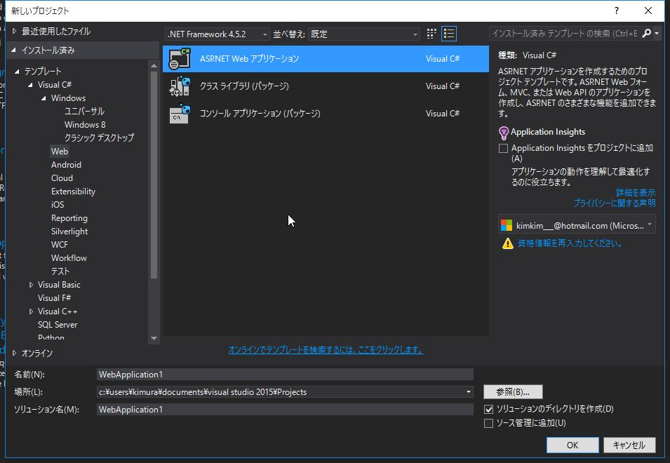
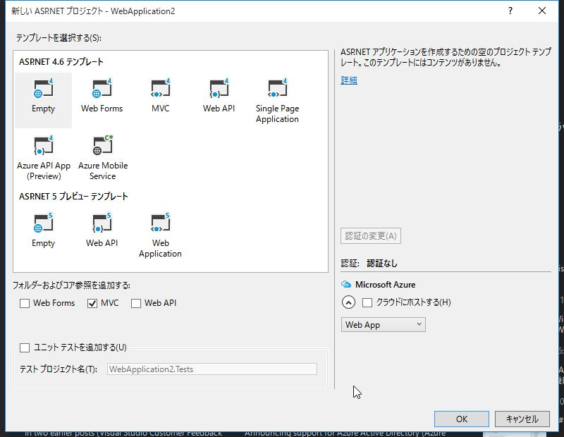
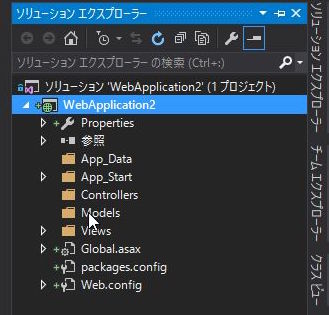
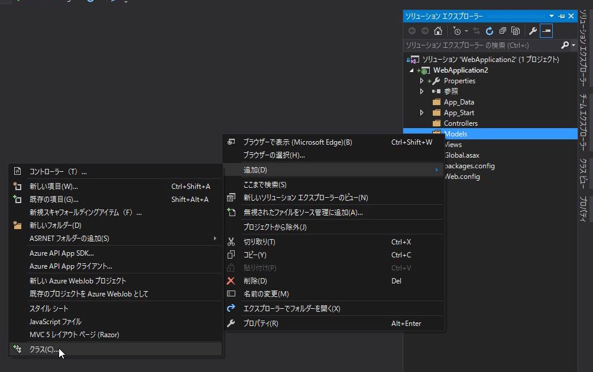
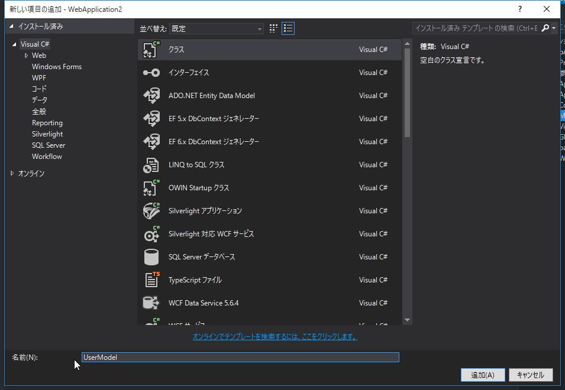
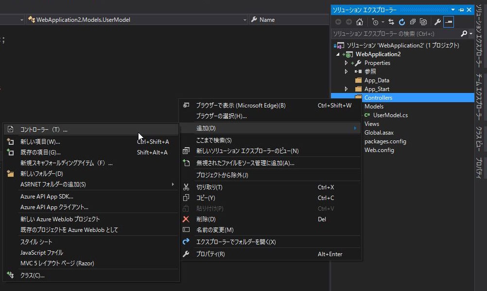
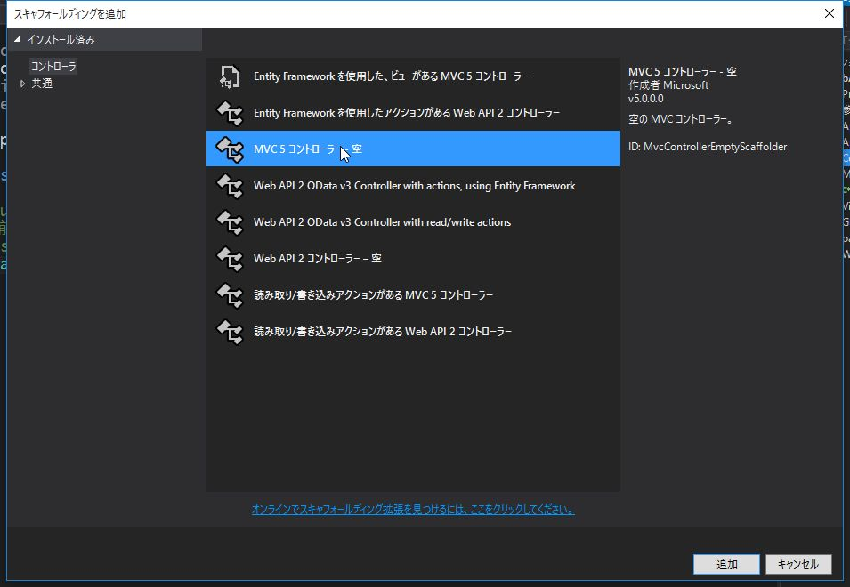
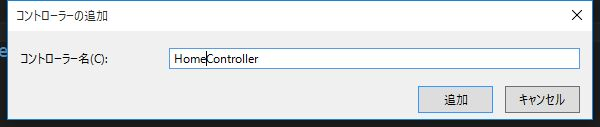
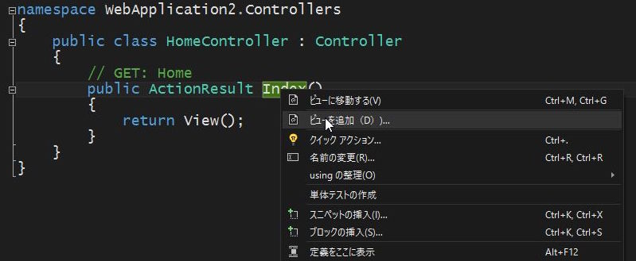

# 2. ASP.NET MVC の基礎

非常に簡単な ASP.NET MVC のサンプルを作成を通して Model,View,Controllerの役割について解説します。

<br>

名前を入力してボタンをクリックすると、  
「こんにちは、○○さん！」というメッセージを表示するアプリケーションを作成します。

名前を入力する `Index` 画面と、
「こんにちは」メッセージを表示する `Hello` 画面の
2画面構成とします。

<br><br>

## 「ASP.NET Webアプリケーション」プロジェクトの作成

「新しいプロジェクト」を選択します。

<br>

*Web* -> *ASP.NET Webアプリケーション* を選択します。


<br>

テンプレートは *Empty* を選択し、*MVC* にチェックを入れて *OK* をクリックします。


<br>

以下の様なフォルダ構成でプロジェクトが生成されます。


<br>
<br>

## Modelクラスの作成

まずは、データを格納する *Model* クラスを作成します。

<br>

*Models* フォルダを右クリックし、*追加* -> *クラス* を選択します。


<br>

名前を `UserModel` として *追加* をクリックします。


<br>

```cs
using System.ComponentModel;

namespace WebApplication2.Models
{
    public class UserModel
    {
        /// <summary>
        /// 名前
        /// </summary>
        [DisplayName("お名前")]
        public string Name { get; set; }
    }
}
```

`Name` というプロパティを定義します。

また、 `Name` プロパティの名前として、`DisplayName` に *お名前* をセットしています。

<br><br>

## Controllerクラスの作成

つづいて、*Controller* を作成します。

<br>

*Controllers* フォルダを右クリックし、*追加* -> *コントローラー* を選択します。


<br>

*MVC5 コントローラー-空* を選択し、*追加* をクリックします。


<br>

コントローラー名を `HomeController` とし、*追加* をクリックします。


* コントローラークラスの名前は必ず`Controller`で終わる必要があります。
* コントローラーは`Controller`クラスを継承します。
(Controllerクラスを継承した独自のControllerクラスでも構いません)

<br>

ブラウザからのリクエストを処理するメソッド (*アクションメソッド* と呼ばれます)
を作成していきます。

<br>

以下の3つのメソッドを定義します。

1. *Index* 画面を表示する *Index* メソッド
2. *Index* 画面から入力された値を受け取る *Index* メソッド
3. *Hello* 画面を表示する *Hello* メソッド

<br>

```cs
using System;
using System.Collections.Generic;
using System.Linq;
using System.Web;
using System.Web.Mvc;
using WebApplication2.Models;

namespace WebApplication2.Controllers
{
    public class HomeController : Controller
    {
        // GET: Home
        public ActionResult Index()
        {
            return View(new UserModel());
        }

        /// <summary>
        /// 名前をpostされたときの処理
        /// </summary>
        /// <param name="user"></param>
        /// <returns></returns>
        [HttpPost]
        public ActionResult Index([Bind(Include = "Name")] UserModel user)
        {
            return RedirectToAction("Hello", user);
        }

        /// <summary>
        /// あいさつページの表示
        /// </summary>
        /// <param name="user"></param>
        /// <returns></returns>
        public ActionResult Hello(UserModel user)
        {
            if (string.IsNullOrEmpty(user.Name))
            {
                return RedirectToAction("Index");
            }
            return View(user);
        }
    }
}
```

<br>

ひとつ目の `Index` メソッドは、最初に `/Home/Index` に
アクセスした際に実行されます。

[View](https://msdn.microsoft.com/ja-jp/library/dd492930.aspx) メソッドは
アクションメソッドに対応した View を元に `ViewResult` ( `ActionResult` を継承した、Viewを表示するためのクラス)を返します。

ここでは、空っぽの *UserModel* を返しています。

<br>

ふたつ目の `Index` メソッドは、`/Home/Index` で
フォームの内容が送信されてきた際に実行されます。

`[HttpPost]`は `http` の `POST`メソッドで
リクエストがあった場合に呼び出されるアクションメソッドを表す
属性です。

[Bind](https://msdn.microsoft.com/ja-jp/library/system.web.mvc.bindattribute.aspx) は POSTされたデータを
`UserModel` に格納します。

`RedirectToAction` は、指定したアクションメソッドに処理を転送します。

ここでは、`Hello` メソッドに `UserModel` のデータを引き渡して
呼び出しています。

<br>

みっつ目の `Hello` メソッドは ふたつ目の `Index` から
`UserModel` を受け取って、画面に表示します。

直接 `/Home/Hello` にアクセスした場合は
引数の `UserModel` に空っぽのデータが入ってます。

その場合はひとつ目の `Index` メソッドに処理を転送します。

<br>
<br>

### 用語解説: ActionResultクラス

アクションメソッドは、戻り値となる `ActionResult` の派生オブジェクトを介してアクションの結果 (その後に行うべき挙動) を通知します。

代表的なActionResultの派生クラスは以下の通りです。

<table>
  <thead>
    <tr>
      <th>クラス名</th>
      <th>ヘルパーメソッド</th>
      <th>概要</th>
    </tr>
  </thead>
  <tbody>
    <tr>
      <td>ViewResult</td>
      <td>View</td>
      <td>アクションメソッドに対応したViewを出力</td>
    </tr>
    <tr>
      <td>RedirectToRouteResult</td>
      <td>RedirectToAction</td>
      <td>指定のアクションメソッドに処理を転送</td>
    </tr>
    <tr>
      <td>ContentResult</td>
      <td>Content</td>
      <td>指定されたテキストを出力</td>
    </tr>
    <tr>
      <td>FileContentResult</td>
      <td>File</td>
      <td>指定されたファイルを出力</td>
    </tr>
    <tr>
      <td>JsonResult</td>
      <td>Json</td>
      <td>指定されたオブジェクトをJSON形式で出力</td>
    </tr>
    <tr>
      <td>HttpNotFoundResult</td>
      <td>HttpNotFound</td>
      <td>404ページを出力</td>
    </tr>
    <tr>
      <td>EmptyResult</td>
      <td>-</td>
      <td>なにも行わない</td>
    </tr>
  </tbody>
</table>

<br>
<br>

## Viewの作成

*アクションメソッド* に対応した *View* を作成し、アプリを完成させます。

<br>
<br>

### Viewの追加

*Index* メソッドを右クリックし、*ビューを追加* を選択します。



`Empty`, モデルに `UserModel` を選択します。

同様に、*Hello* メソッドを右クリックし *ビューを追加* を選択します。  
`Empty`, モデルに `UserModel` を選択します。

<br>
<br>

### 用語解説: Razor

`Razor` は HTMLにC#/VBのコードを埋め込むための仕組み (ビューエンジン) です。
`@`で始まる箇所がサーバーサイドで実行され、クライアントに生成したHTMLが返されます。

<br><br>

### コードナゲット と コメントの書き方

`@`から始まる文はRazorの *コードナゲット* としてサーバーサイドで処理されます。

HTML内にRazorの式としてではなく、`@`をそのまま表示したい場合は
`@@` とすることでエスケープして表示されます。

また、コメントを記載する場合は `@* ... *@` と記述します。  
HTMLのコメントと異なり、サーバーサイドでコメントとして処理されるため、ブラウザでソースを表示しても
`@* ... *@` は出力されません。

<br><br>

### HTMLヘルパー

`@Html`から始まるメソッドは *HTMLヘルパー* と呼ばれ、HTMLの生成をカプセル化します。

* `@Html.LabelFor()` を使用すると、表示名を `<label>` タグで括って出力します。
* `@Html.DisplayFor()` や `@Html.EditorFor()` は引数に渡したプロパティの型に応じて出力される内容が変わります。

<br>
<br>

`Views/Index.cshtml`

```html
@model WebApplication2.Models.UserModel

@{
    Layout = null;
}

<!DOCTYPE html>

<html>
<head>
    <meta name="viewport" content="width=device-width" />
    <title>Index</title>
</head>
<body>
    <div>
        <p>あなたのお名前を教えてください。</p>
        @using (Html.BeginForm())
        {
            @Html.LabelFor(model => model.Name)
            @Html.EditorFor(model => model.Name)
            <button type="submit">OK</button>
        }
    </div>
</body>
</html>
```

<br>

`@model` は、コントローラから渡されるデータを表します。

`Layout` は、各Viewで共通のレイアウトを使用する場合に指定します。  
(今回はレイアウトは使用しません。)

`@using (Html.BeginForm()) { ... }` はカッコ内を `<form>` タグで括ります。

`@Html.LabelFor()`, `@Html.EditorFor()` でラベルとテキストボックスを生成します。

<br>

`Views/Hello.cshtml`

```html
@model WebApplication2.Models.UserModel

@{
    Layout = null;
}

<!DOCTYPE html>

<html>
<head>
    <meta name="viewport" content="width=device-width" />
    <title>Hello</title>
</head>
<body>
    <div>
        <p>こんにちは、 @Html.DisplayFor(model => model.Name) さん！</p>
    </div>
</body>
</html>
```

`@Html.DisplayFor()` でコントローラから渡されたデータを表示しています。

コントローラの `Hello` メソッドから渡されたユーザー名を表示します。

<br><br>

----------

<br>

非常にシンプルなWebアプリの作成を通して、 *ASP.NET MVC* の基本的な要素について解説しました。

<br>
<br>
