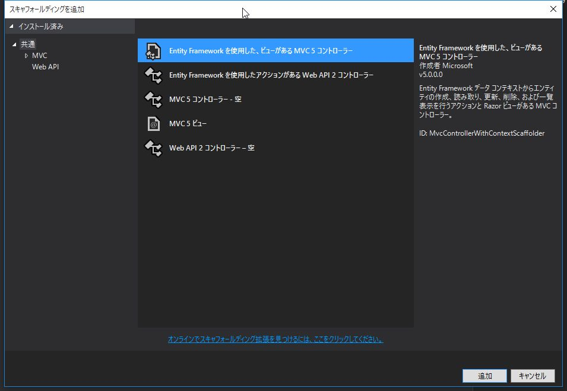

# 3. EntityFramework によるデータベースファースト開発

## EntityFrameworkによるソースコードの自動生成

*EntityFramework* によって Webアプリケーションの雛形を作成します。

### (1) プロジェクトの作成

`DrugInfoSearch` という名前で新しいプロジェクトを作成します。

*テンプレート* は `Empty` を選択します。  
`MVC` にチェックを入れ、*OK* をクリックします。

  

### (2) EntityFrameworkのインストール

*NuGet* で 最新の *EntityFramework* をインストールします。

  

### (3) EDMファイルの作成

一度ビルドを行う。

  

### (4) コントローラー、ビューの作成

スキャフォールディング(Scaffolding、「骨組み」「足場」という意味)によって、
Create（作成）、Read（参照）、Update（更新）、Delete（削除）のような定型的なコードの骨組みを自動生成できます。

 

*ソリューション エクスプローラー* で *Controllers* を右クリック -> *追加* ->
*新規スキャフォールディングアイテム* を選択します。

*Entity Framework を使用した、ビューがあるMVC5 コントローラー* を選択し、*追加* をクリックします。

*モデル クラス* に `Drugs` 、 *データ コンテキスト クラス* に `DrugInfoContext` を選択し、*追加* をクリックします。

  

### (5) 動作確認

  
