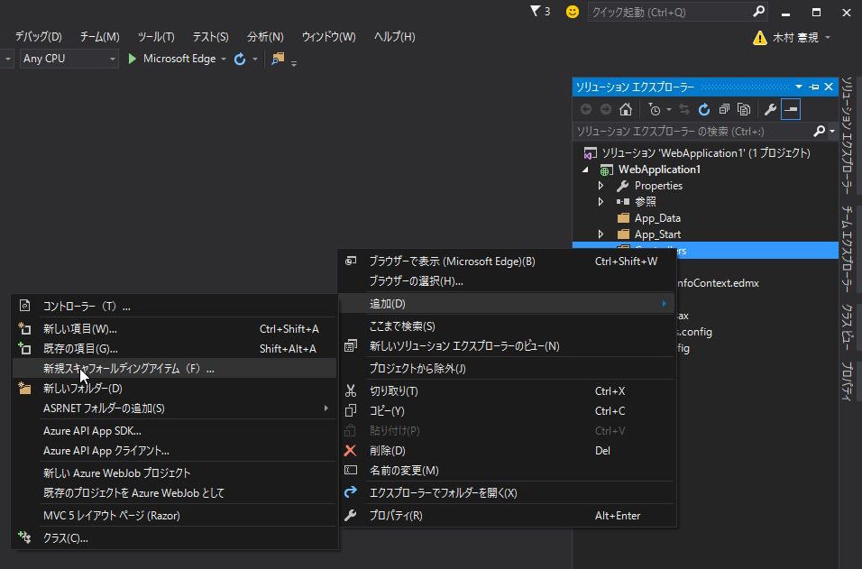

# 3. EntityFramework によるデータベースファースト開発

今回は *EntityFramework* によって Webアプリケーションの雛形を作成する *データベース ファースト開発* について解説します。


<br><br>

## EntityFrameworkによるソースコードの自動生成

*EntityFramework* によって、データベースのテーブル構造を元にアプリケーションの雛形を自動生成することが可能です。

<br><br>

### (1) プロジェクトの作成

`DrugInfoSearch` という名前で新しいプロジェクトを作成します。


<br><br>

*テンプレート* は `Empty` を選択します。  
`MVC` にチェックを入れ、*OK* をクリックします。


<br><br>

### (2) EntityFrameworkのインストール

*NuGet* で 最新の *EntityFramework* をインストールします。


<br><br>


<br><br>

### (3) EDMファイルの作成


<br><br>


<br><br>


<br><br>


<br><br>


<br><br>


<br><br>

一度ビルドを行ってください。  
（ビルドしなかった場合、次の手順でエラーとなります。）


<br><br>

### (4) コントローラー、ビューの作成

スキャフォールディング(Scaffolding、「骨組み」「足場」という意味)によって、
Create（作成）、Read（参照）、Update（更新）、Delete（削除）のような定型的なコードの骨組みを自動生成できます。

<br>

*ソリューション エクスプローラー* で *Controllers* を右クリック -> *追加* ->
*新規スキャフォールディングアイテム* を選択します。


<br>

*Entity Framework を使用した、ビューがあるMVC5 コントローラー* を選択し、*追加* をクリックします。


<br>

*モデル クラス* に `Drugs` 、 *データ コンテキスト クラス* に `DrugInfoContext` を選択し、*追加* をクリックします。


<br><br>

### (5) ルーティングの設定

`App_Start/RouteConfig.cs` を修正し、デフォルトページをToDoの一覧ページに変更します。

`routes.MapRoute`メソッドの`defaults`引数にデフォルトの設定を定義します。

```cs
using System;
using System.Collections.Generic;
using System.Linq;
using System.Web;
using System.Web.Mvc;
using System.Web.Routing;

namespace WebApplication1
{
    public class RouteConfig
    {
        public static void RegisterRoutes(RouteCollection routes)
        {
            routes.IgnoreRoute("{resource}.axd/{*pathInfo}");

            routes.MapRoute(
                name: "Default",
                url: "{controller}/{action}/{id}",
                defaults: new { controller = "Drugs", action = "Index", id = UrlParameter.Optional }
            );
        }
    }
}
```

<br><br>

------

### 用語解説: ルーティング

ルーティングとは、リクエストURIに応じて処理を受け渡し先を決定することを言います。

`ASP.NET MVC` ではクライアントからの要求を受け取ると、`RouteConfig.cs` の内容を元に
呼び出すべきコントローラー/アクションを決定します。

`routes.MapRoute`メソッドの`url`引数がルーティングの定義です。

例えば `http://localhost/Drugs/Details/3` というリクエストが来た場合、
`url` の定義にしたがって `DrugsController` の `Details` メソッドに `id=3` を引数に与えて呼び出します。

また、 `defaults` でデフォルトのコントローラー、アクションを指定しているので、`http://localhost/` という
リクエストが来た場合は `http://localhost/Drugs/Index` というリクエストとして処理されます。

<br><br>

### (6) 動作確認


<br><br>


<br><br>


<br><br>
