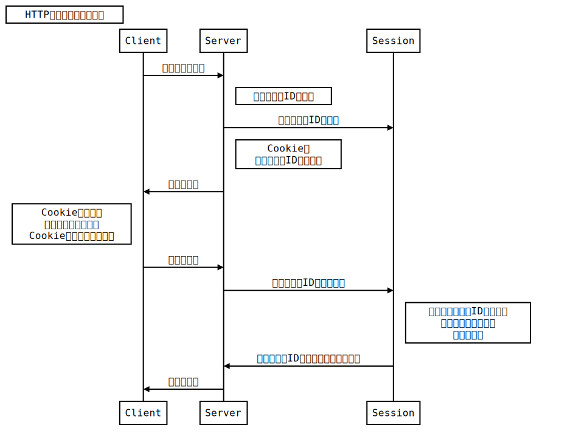
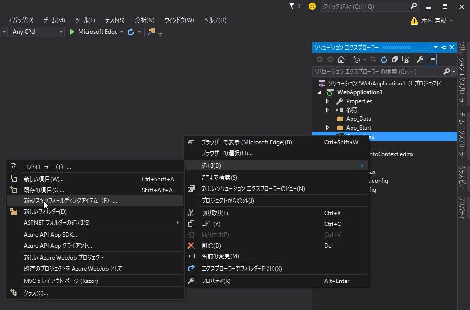
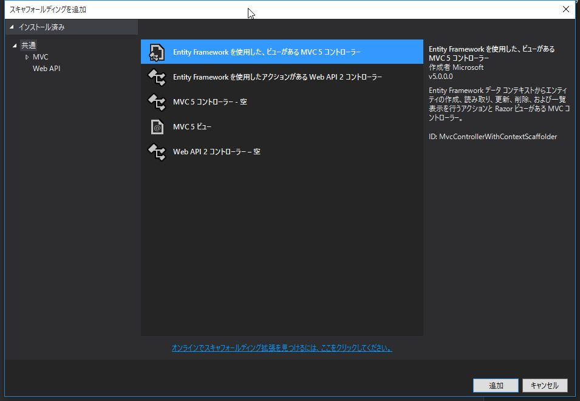
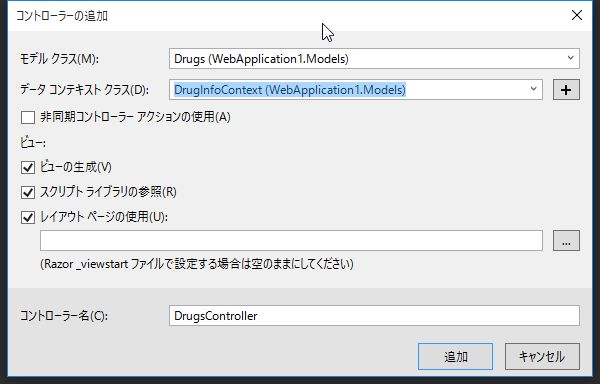

# 薬品情報検索システムの機能追加

## 検索条件の保持

これまでの実装では、他画面に遷移した後に `/Home/Index` に戻ってくると、
検索結果が失われていました。

前回の検索結果を復元するように機能を追加します。

<br><br>

### 用語解説: セッション

*HTTP* には、画面遷移間で一連の処理であることを識別する仕様はありません。  
このことを *HTTPはステートレスなプロトコルである* 、と言います。

ログイン情報などをWebアプリケーションで保持するために、*セッション* という仕組みがあります。




<br><br>

### 検索条件を保持する

*Home/Index* で *POST* されてきた際に、
検索条件を *Session* に格納するように機能を追加します。

`Controllers/HomeController.cs`

```cs
// POST: Home
[HttpPost]
[ValidateAntiForgeryToken]
public ActionResult Index([Bind(Include = "DrugName,ClassificationId")] SearchViewModel model)
{
    if (ModelState.IsValid)
    {
        // 検索処理
        var list = db.Drugs.Where(item =>
            (string.IsNullOrEmpty(model.DrugName) || item.Name.Contains(model.DrugName))
            && (model.ClassificationId == 0 || item.ClassificationId == model.ClassificationId)).ToList();
        model.Drugs = list;

        // 検索条件を復元するためにSessionに保持
        Session["DrugName"] = model.DrugName;
        Session["ClassificationId"] = model.ClassificationId;
    }
    this.SetClassificationItems();
    return View(model);
}
```

<br><br>

### 検索条件を復元する

*Home/Index* に *GET* された際に
*Session* に検索条件が格納されている場合は、それを復元します。

`Controllers/HomeController.cs`

*ViewBag* にコンボボックスの項目をセットするメソッドを修正し、初期選択値を指定できるようにします。

```cs
/// <summary>
/// ViewBagにコンボボックスの項目をセット
/// </summary>
private void SetClassificationItems()
{
    this.SetClassificationItems(0);
}

/// <summary>
/// ViewBagにコンボボックスの項目をセット
/// </summary>
/// <param name="selectedId">初期選択</param>
private void SetClassificationItems(int selectedId)
{
    var list = db.Classifications.Select(item => new SelectListItem
    {
        Text = item.ClassificationCode + ":" + item.Name,
        Value = item.ClassificationId.ToString(),
        Selected = item.ClassificationId == selectedId
    }).ToList();

    // 先頭にブランクを挿入
    list.Insert(0, new SelectListItem {
        Text = string.Empty,
        Value = "0",
        Selected = selectedId == 0
    });

    ViewBag.ClassificationId = list;
}
```

<br>

つづいて、*Session* に検索条件がセットされている場合はそれを取り出し
検索結果を表示するように修正します。

```cs
// GET: Home
public ActionResult Index()
{
    var model = new SearchViewModel();
    model.ClassificationId = 0; // コンボボックスの初期選択

    if (Session["DrugName"] != null || Session["ClassificationId"] != null)
    {
        model.DrugName = (string)Session["DrugName"];
        model.ClassificationId = (int)Session["ClassificationId"];

        // 検索処理
        var list = db.Drugs.Where(item =>
            (string.IsNullOrEmpty(model.DrugName) || item.Name.Contains(model.DrugName))
            && (model.ClassificationId == 0 || item.ClassificationId == model.ClassificationId)).ToList();
        model.Drugs = list;
    }

    // コンボボックスの項目を設定
    this.SetClassificationItems(model.ClassificationId);

    return View(model);
}
```

<br><br>

## 薬効分類のメンテナンス画面を追加

薬効分類のメンテナンス機能を追加します。

*EntityFrameworkのデータベースファースト開発* によって
`ClassificationsController` と各ビューを自動生成します。

<br><br>

### コントローラー、ビューの自動生成

*ソリューション エクスプローラー* で *Controllers* を右クリック -> *追加* ->
*新規スキャフォールディングアイテム* を選択します。


<br>

*Entity Framework を使用した、ビューがあるMVC5 コントローラー* を選択し、*追加* をクリックします。


<br>

*モデル クラス* に `Classifications` 、 *データ コンテキスト クラス* に `DrugInfoContext` を選択し、*追加* をクリックします。



<br><br>

### Classifications の メタデータクラスを確認

`Models/ClassificationsMetadata.cs`

```cs
using System.ComponentModel;
using System.ComponentModel.DataAnnotations;

namespace WebApplication1.Models
{
    [MetadataType(typeof(ClassificationsMetadata))]
    public partial class Classifications
    {
    }

    public class ClassificationsMetadata
    {
        [DisplayName("薬効分類ID")]
        public int ClassificationId { get; set; }

        [DisplayName("薬効分類コード")]
        [Required(ErrorMessage = "薬効分類コードは必須項目です。")]
        [StringLength(3, ErrorMessage = "薬効分類コードは3桁で入力してください。")]
        public string ClassificationCode { get; set; }

        [DisplayName("薬効分類")]
        [Required(ErrorMessage = "薬効分類名称は必須項目です。")]
        public string Name { get; set; }
    }
}
```

<br><br>

### ナビゲーションバーの変更

ナビゲーションバーに薬効分類の一覧へ遷移するリンクを追加します。

```html
@{
    ViewBag.ApplicationName = "薬品情報検索";
}
<!DOCTYPE html>
<html>
<head>
    <meta charset="utf-8" />
    <meta name="viewport" content="width=device-width, initial-scale=1.0">
    <title>@ViewBag.Title - @ViewBag.ApplicationName</title>
    <link href="~/Content/Site.css" rel="stylesheet" type="text/css" />
    <link href="~/Content/bootstrap.min.css" rel="stylesheet" type="text/css" />
    <script src="~/Scripts/modernizr-2.6.2.js"></script>
</head>
<body>
    <div class="navbar navbar-inverse navbar-fixed-top">
        <div class="container">
            <div class="navbar-header">
                <button type="button" class="navbar-toggle" data-toggle="collapse" data-target=".navbar-collapse">
                    <span class="icon-bar"></span>
                    <span class="icon-bar"></span>
                    <span class="icon-bar"></span>
                </button>
                @Html.ActionLink((string)ViewBag.ApplicationName, "Index", "Home", new { area = "" }, new { @class = "navbar-brand" })
            </div>
            <div class="navbar-collapse collapse">
                <ul class="nav navbar-nav">
                    <li>
                        @Html.ActionLink("薬効分類", "Index", new { Controller = "Classifications" })
                    </li>
                </ul>
            </div>
        </div>
    </div>

    <div class="container body-content">
        @RenderBody()
        <hr />
        <footer>
            <p>&copy; @DateTime.Now.Year - @ViewBag.ApplicationName</p>
        </footer>
    </div>

    <script src="~/Scripts/jquery-1.10.2.min.js"></script>
    <script src="~/Scripts/bootstrap.min.js"></script>
</body>
</html>
```

<br><br>

-------

検索機能と薬効分類のメンテナンス機能の追加を行いました。

次回は認証機能を追加し、アプリケーションを完成させます。

<br><br>
