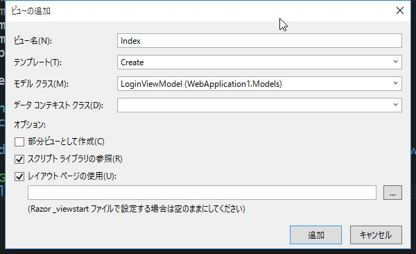

# 5. メンバーシップ フレームワークによる認証機能の実装 (前編)

## ASP.NETの認証機能について

### メンバーシップ フレームワーク

ASP.NET 2.0 以降から採用された認証ライブラリです。比較的シンプルに実装できるため、広く利用されています。  
今回はメンバーシップフレームワークによる認証・認可機能の実装方法を解説します。

<br>
<hr>
<br>

### 【用語解説】ASP.NET Identity

*ASP.NET Identity* は Visual Studio 2013 から新たに搭載された認証ライブラリです。

以下の様な特徴があります。

- Entity Framework を基板としているため、アカウント情報の管理に関する実装が容易である
- ActiveDirectoryによる認証に対応
- Twitter, Facebook, Googleなどのソーシャルアカウントによる認証に対応
- 2要素認証に対応

Visual Studio 2013 で ASP.NETプロジェクトを作成するときに生成されるソースコードには、ASP.NET Identityによる認証機能が予め実装されています。

<br>
<hr>
<br>

## フォーム認証の実装

前回までに作成したアプリケーションに認証機能を実装していきます。

<br><br>

### 1. Providerクラスの実装

認証機能を司る *Provider* クラスを作成していきます。

<br>

### (1) *MembershipProvider* の実装

*MembershipProvider* クラスを継承したクラスを実装します。

<br>

* *Models* を右クリックし、*追加* -> *クラス* を選択します。
* クラス名を *CustomMembershipProvider.cs* とします。
* `MembershipProvider` を継承します。
  - `using System.Web.Security;` を追記します。
* `CustomMembershipProvider` に赤線が表示されますので、右クリック -> *抽象クラスの実装* を選択します。

<br>

`Models/CustomMembershipProvider.cs`

```cs
using System.Web.Security;

namespace TodoApp.Models
{
    public class CustomMembershipProvider : MembershipProvider
    {
        /* ~~ 省略 ~~ */

        public override bool ValidateUser(string username, string password)
        {
            // とりあえず固定で認証
            if ("administrator".Equals(username) && "password".Equals(password))
            {
                return true;
            }
            if ("user".Equals(username) && "password".Equals(password))
            {
                return true;
            }
            return false;
        }
    }
}
```

<br>

幾つか *override* しないといけないメソッドがありますが
今回使用するのは `ValidateUser` メソッドだけなので、
このメソッドのみ実装します。

* `ValidateUser` は `username` と `password` を受け取って認証の成否を返します。

認証の動作を確認するため、ひとまず `username` 、 `password` は固定としています。

<br><br>

### (2) *RoleProvider* の実装

つづいて、 *RoleProvider* クラスを継承したクラスを実装します。

<br>

* *Models* を右クリックし、*追加* -> *クラス* を選択します。
* クラス名を *CustomRoleProvider.cs* とします。
* `RoleProvider` を継承します。
  - `using System.Web.Security;` を追記します。
* `CustomRoleProvider` に赤線が表示されますので、右クリック -> *抽象クラスの実装* を選択します。

<br>

`Models/CustomRoleProvider.cs`

```cs
namespace TodoApp.Models
{
    public class CustomRoleProvider : RoleProvider
    {
        /* ~~ 省略 ~~ */

        public override string[] GetRolesForUser(string username)
        {
            if ("administrator".Equals(username))
            {
                return new string[] { "Administrators" };
            }
            return new string[] { "Users" };
        }

        /* ~~ 省略 ~~ */

        public override bool IsUserInRole(string username, string roleName)
        {
            if ("administrator".Equals(username) && "Administrators".Equals(roleName))
            {
                return true;
            }
            if ("user".Equals(username) && "Users".Equals(roleName))
            {
                return true;
            }
            return false;
        }

        /* ~~ 省略 ~~ */
    }
}
```

<br>

*MembershipProvider* と同様、今回使用するメソッドのみ中身を実装します。

* `GetRolesForUser` メソッドは 指定されたユーザーが所属するロールの配列を返します。
* `IsUserInRole` メソッドは 指定されたユーザーが、該当するロールに所属しているかどうかを返します。

<br><br>

### 2. *LoginViewModel* の実装

ログイン画面の入力項目を *LoginViewModel* として定義します。

<br>

* *Models* を右クリックし、*追加* -> *クラス* を選択します。
* クラス名を *LoginViewModel.cs* とします。

<br>

`Models/LoginViewModel.cs`

```cs
namespace TodoApp.Models
{
    public class LoginViewModel
    {
        [Required]
        [DisplayName("ユーザー名")]
        public string UserName { get; set; }

        [Required]
        [DisplayName("パスワード")]
        public string Password { get; set; }
    }
}
```

<br><br>

### 3. Controllerの実装

### (1) *LoginController* の実装

<br>

* *Controllers* を右クリックし、*追加* -> *コントローラー* を選択します。
* *MVC5 コントローラー - 空* を選択します。
* 名前を *LoginController* とします。

<br>

`Controllers/LoginController.cs`

```cs
using System.Web.Mvc;
using System.Web.Security;
using TodoApp.Models;

namespace TodoApp.Controllers
{
    [AllowAnonymous]
    public class LoginController : Controller
    {
        readonly CustomMembershipProvider membershipProvider = new CustomMembershipProvider();

        // GET: Login
        public ActionResult Index()
        {
            return View();
        }

        [HttpPost]
        [ValidateAntiForgeryToken]
        public ActionResult Index([Bind(Include="UserName,Password")] LoginViewModel model)
        {
            if (ModelState.IsValid)
            {
                if (this.membershipProvider.ValidateUser(model.UserName, model.Password))
                {
                    FormsAuthentication.SetAuthCookie(model.UserName, false);
                    return RedirectToAction("Index", "Home");
                }
            }
            ViewBag.Message = "ログインに失敗しました。";
            return View(model);
        }

        public ActionResult SignOut()
        {
            FormsAuthentication.SignOut();
            return RedirectToAction("Index");
        }
    }
}
```

* `[AllowAnonymous]` は `LoginController` 全体へのアクセスで、認証を不要とします。
* `[HttpPost] Index` で認証処理を行います。

ログイン画面で入力された内容は `LoginViewModel` に
格納されます。

送られてきたユーザー名、パスワードを `MembershipProvider` でチェックし、認証OKであれば
`FormsAuthentication.SetAuthCookie` メソッドを実行します。

第2引数の boolean は、認証クッキーを残すかどうかのフラグです。
ログイン画面によくある、「次回から自動的にログイン」とか「ログインしたままにする」といったチェックボックスの機能です。

認証後、Home画面にリダイレクトしています。

* `SignOut` メソッドで認証クッキーが削除され、
ログアウトした状態となります。

<br><br>

### (2) 認証が必要なControllerの実装

`HomeController` と `DrugsController` にはすべてのユーザーがアクセス可能、
`ClassificationsController` には
`Administrators` のみがアクセス可能なように
実装します。

<br>

`Controllers/HomeController.cs`

```cs
namespace TodoApp.Controllers
{
    [Authorize]
    public class HomeController : Controller
    {
        // GET: Home
        public ActionResult Index()
        {
            /* ~~ 省略 ~~ */
        }
    }
}
```

`[Authorize]` は `HomeController` にアクセスするために認証が必要であることを示します。

認証されていない状態でアクセスすると、ログイン画面にリダイレクトされます。

<br><br>

### (3) *ClassificationsController* の実装

例として、薬効分類のメンテナンスは *Administrators* の
ロールに所属しているユーザーのみ可能なように設定します。

`Controllers/ClassificationsController.cs`

```cs
namespace TodoApp.Controllers
{
    [Authorize(Roles="Administrators")]
    public class ClassificationsController : Controller
    {
        // GET: Admin
        public ActionResult Index()
        {
            /* ~~ 省略 ~~ */
        }
    }
}
```

`[Authorize(Roles="Administrators")]` は `ClassificationsController` に `Administrators` ロールに属するユーザーのみアクセス可能であることを示します。

それ以外のユーザーが該当画面にアクセスした場合、
ログイン画面にリダイレクトされます。

<br>

今回は例としてコントローラー全体に対して
認証の設定を行いましたが、アクションメソッド単位で
制御することも可能です。

<br><br>

### 3. ログイン画面の作成

### *Login/Index.cshtml* の作成

* `LoginController` の `Index` アクションメソッドを右クリック -> *ビューを追加* を選択
* `LoginViewModel` の `Create` として `Index.cshtml` を作成



<br>

`Views/Login/Index.cshtml`

```html
@model TodoApp.Models.LoginViewModel

@{
    ViewBag.Title = "Index";
}

<h2>SignIn</h2>

@using (Html.BeginForm())
{
    @Html.AntiForgeryToken()

    <div class="form-horizontal">
        @Html.ValidationSummary(true, "", new { @class = "text-danger" })
        <div class="form-group">
            @Html.LabelFor(model => model.UserName, htmlAttributes: new { @class = "control-label col-md-2" })
            <div class="col-md-10">
                @Html.EditorFor(model => model.UserName, new { htmlAttributes = new { @class = "form-control" } })
                @Html.ValidationMessageFor(model => model.UserName, "", new { @class = "text-danger" })
            </div>
        </div>

        <div class="form-group">
            @Html.LabelFor(model => model.Password, htmlAttributes: new { @class = "control-label col-md-2" })
            <div class="col-md-10">
                @Html.PasswordFor(model => model.Password, new { @class = "form-control" })
                @Html.ValidationMessageFor(model => model.Password, "", new { @class = "text-danger" })
            </div>
        </div>

        <div class="form-group">
            <div class="col-md-offset-2 col-md-10">
                <input type="submit" value="SignIn" class="btn btn-default" />
            </div>
        </div>
    </div>
}

@if (!string.IsNullOrEmpty(ViewBag.Message))
{
    <p class="text-danger">@ViewBag.Message</p>
}

<script src="~/Scripts/jquery-1.10.2.min.js"></script>
<script src="~/Scripts/jquery.validate.min.js"></script>
<script src="~/Scripts/jquery.validate.unobtrusive.min.js"></script>
```

<br>

* `Password` の入力欄を `PasswordFor` に変更
* ボタンのラベルを `SignIn` に変更
* `Back to List` のリンクを削除
* エラーメッセージを表示するよう追記

<br><br>

### (2) *_Layout.cs* の修正

ナビゲーションバーに *ログアウト (/Login/SignOut)* のリンクを追加します。

`Views/Shared/_Layout.cshtml`

```html
@{
    ViewBag.ApplicationName = "薬品情報検索";
}
<!DOCTYPE html>
<html>
<head>
    <meta charset="utf-8" />
    <meta name="viewport" content="width=device-width, initial-scale=1.0">
    <title>@ViewBag.Title - @ViewBag.ApplicationName</title>
    <link href="~/Content/Site.css" rel="stylesheet" type="text/css" />
    <link href="~/Content/bootstrap.min.css" rel="stylesheet" type="text/css" />
    <script src="~/Scripts/modernizr-2.6.2.js"></script>
</head>
<body>
    <div class="navbar navbar-inverse navbar-fixed-top">
        <div class="container">
            <div class="navbar-header">
                <button type="button" class="navbar-toggle" data-toggle="collapse" data-target=".navbar-collapse">
                    <span class="icon-bar"></span>
                    <span class="icon-bar"></span>
                    <span class="icon-bar"></span>
                </button>
                @Html.ActionLink((string)ViewBag.ApplicationName, "Index", "Home", new { area = "" }, new { @class = "navbar-brand" })
            </div>
            <div class="navbar-collapse collapse">
                <ul class="nav navbar-nav">
                    <li>
                        @Html.ActionLink("薬効分類", "Index", new { Controller = "Classifications" })
                    </li>
                </ul>
                <p class="navbar-text navbar-right">
                    @Html.ActionLink("ログアウト", "SignOut", new { Controller = "Login" }, new { @class="navbar-link" })
                </p>
            </div>
        </div>
    </div>

    <div class="container body-content">
        @RenderBody()
        <hr />
        <footer>
            <p>&copy; @DateTime.Now.Year - @ViewBag.ApplicationName</p>
        </footer>
    </div>

    <script src="~/Scripts/jquery-1.10.2.min.js"></script>
    <script src="~/Scripts/bootstrap.min.js"></script>
</body>
</html>
```


<br><br>

### 4. web.configの設定

最後に、フォーム認証を行うように `Web.config` に設定を追加します。

(ファイル名の先頭が大文字のファイルです。 *Views/web.config* と間違えないように。)

```xml
:
<system.web>
  <compilation debug="true" targetFramework="4.5.1"/>
  <httpRuntime targetFramework="4.5.1"/>
  <authentication mode="Forms">
    <forms loginUrl="~/Login/Index"></forms>
  </authentication>
  <membership defaultProvider="CustomMembershipProvider">
    <providers>
      <clear/>
      <add name="CustomMembershipProvider" type="WebApplication1.Models.CustomMembershipProvider"/>
    </providers>
  </membership>
  <roleManager enabled="true" defaultProvider="CustomRoleProvider">
    <providers>
      <clear/>
      <add name="CustomRoleProvider" type="WebApplication1.Models.CustomRoleProvider"/>
    </providers>
  </roleManager>
</system.web>
:
```

* `authentication` タグの追加
  - `mode="Forms"` でフォーム認証を行うことを指定
  - `forms` タグでログイン画面を指定
* `membership` タグの追加
  - `CustomMembershipProvider` クラスを指定
* `roleManager` タグの追加
  - `CustomRoleProvider` クラスを指定

<br><br>

デバッグ実行して動作確認を行います。
以下の通り動作を確認します。

* 認証を行わないとログイン画面以外のページが表示できないこと
* ログアウトのリンクをクリックするとログイン画面に戻ること
* *administrator* 以外のユーザーでは薬効分類のメンテナンス画面が表示できないこと

<br><br>

------

フォーム認証の実装方法について解説しました。

次回は以下の内容を取り上げます。

* ユーザーとロールの情報をデータベースで管理する
* ユーザー・ロールの管理画面の追加
* ロールによって画面表示を切り替える

[次へ](./asp-302.html)

<br><br>
