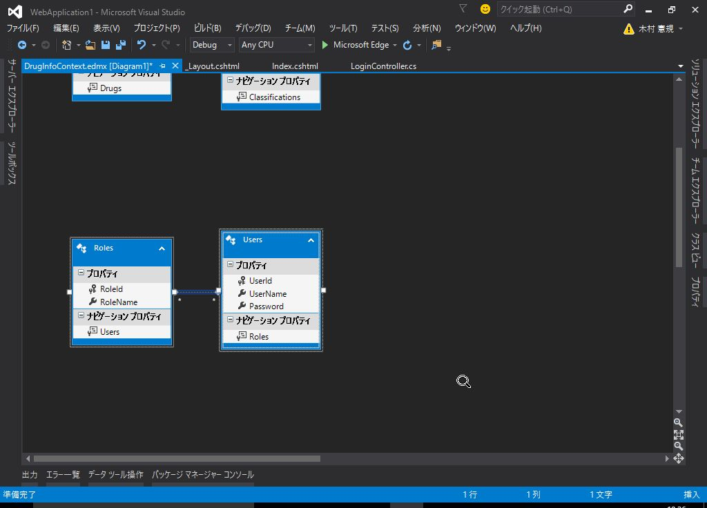

# 5. メンバーシップ フレームワークによる認証機能の実装 (後編)

## (1) ユーザーとロールの情報をデータベースで管理する

### Users, Rolesテーブルの追加

ユーザーとロールを管理するテーブルを作成します。

*User* と *Role* は 多対多の関係となるので
関連付けを管理する *UserRole* テーブルを作成します。


```sql
CREATE TABLE [dbo].[Users] (
  [UserId] INT IDENTITY (1, 1) NOT NULL,
  [UserName] NVARCHAR (200) NOT NULL,
  [Password] NVARCHAR (200) NOT NULL,
  PRIMARY KEY CLUSTERED ([UserId] ASC)
);

CREATE TABLE [dbo].[Roles] (
  [RoleId] INT IDENTITY (1, 1) NOT NULL,
  [RoleName] NVARCHAR (200) NOT NULL,
  PRIMARY KEY CLUSTERED ([RoleId] ASC)
);

CREATE TABLE [dbo].[UserRole] (
  [UserID] INT NOT NULL,
  [RoleID] INT NOT NULL,
  CONSTRAINT [FK_dbo.UserRole_dbo.User_UserID] FOREIGN KEY ([UserID])
    REFERENCES [dbo].[Users] ([UserID]) ON DELETE CASCADE,
  CONSTRAINT [FK_dbo.UserRole_dbo.Role_RoleID] FOREIGN KEY ([RoleID])
    REFERENCES [dbo].[Roles] ([RoleID]) ON DELETE CASCADE
);
```

<br><br>

### 初期データの登録

*administrator* と *user* というユーザーを作成します。

```sql
insert into dbo.Users ([UserName], [Password]) values ('administrator', 'password');
insert into dbo.Users ([UserName], [Password]) values ('user', 'password');
```

<br>

*Administrators* と *Users* というロールを作成します。

```sql
insert into dbo.Roles ([RoleName]) values ('Administrators');
insert into dbo.Roles ([RoleName]) values ('Users');
```

*administrator* と *Administrators* を、
*user* と *Users* を紐付けます。

```sql
insert into dbo.UserRole ([UserId], [RoleId]) values (1, 1);
insert into dbo.UserRole ([UserId], [RoleId]) values (2, 2);
```


<br><br>

### EDMファイルの更新

`Models/DrugInfoContext.edmx` を開きます。

右クリックし *データベースからモデルを更新* を選択します。


*追加* タブで、 *テーブル* にチェックを入れ、 *完了* をクリックします。


デザイナーで、*Users* と *Roles* が表示されることを確認します。



<br><br>

### *MembershipProvider* の更新

`Models/CustomMembershipProvider.cs`

```cs
public override bool ValidateUser(string username, string password)
{
    using (var db = new DrugInfoContext())
    {
        var user = db.Users
            .Where(u => u.UserName.Equals(username) && u.Password.Equals(password))
            .FirstOrDefault();

        if (user != null)
        {
            // 認証OK
            return true;
        }
    }
    return false;
}
```

username, passwordを元にユーザーを取得します。

<br><br>

### *RoleProvider* の更新

`Models/CustomRoleProvider.cs`

```cs
public override string[] GetRolesForUser(string userId)
{
    using (var db = new DrugInfoContext())
    {
        int id = int.Parse(userId);
        var user = db.Users
            .Where(u => u.UserId == id)
            .FirstOrDefault();

        if (user != null) {
            string[] roles = user.Roles.Select(r => r.RoleName).ToArray();
            return roles;
        }
        return new string[] {};
    }
}
```

<br>

`GetRolesForUser` は、指定されたユーザーの所属するロールを配列で返します。

<br>

```cs
public override bool IsUserInRole(string userId, string roleName)
{
    using (var db = new DrugInfoContext())
    {
        int id = int.Parse(userId);
        var user = db.Users
            .Where(u => u.Id == id)
            .FirstOrDefault();

        if (user != null) {
            string[] roles = user.Roles.Select(r => r.RoleName).ToArray();

            if (roles.Contains(roleName))
            {
                return true;
            }
        }
    }

    return false;
}
```

<br>

`IsUserInRole` は、指定されたユーザーが該当のロールに所属しているかを判定するメソッドです。

ユーザーIDを元にユーザーを検索し、ユーザーが所属するロールをチェックしています。

<br><br>

### コントローラーの修正

`Controllers/LoginController.cs`

```cs
using System;
using System.Collections.Generic;
using System.Linq;
using System.Web;
using System.Web.Mvc;
using System.Web.Security;
using WebApplication1.Models;

namespace WebApplication1.Controllers
{
    [AllowAnonymous]
    public class LoginController : Controller
    {
        readonly CustomMembershipProvider membershipProvider = new CustomMembershipProvider();
        private DrugInfoContext db = new DrugInfoContext();

        // GET: Login
        public ActionResult Index()
        {
            return View();
        }

        // POST: Login
        [HttpPost]
        [ValidateAntiForgeryToken]
        public ActionResult Index([Bind(Include = "UserName,Password")] LoginViewModel model)
        {
            if (ModelState.IsValid)
            {
                if (this.membershipProvider.ValidateUser(model.UserName, model.Password))
                {
                    var user = db.Users.Where(u => u.UserName.Equals(model.UserName)
                        && u.Password.Equals(model.Password))
                        .FirstOrDefault();

                    if (user != null) {
                        FormsAuthentication.SetAuthCookie(user.UserId.ToString(), false);
                        return RedirectToAction("Index", "Home");
                    }
                }
            }
            ViewBag.Message = "ログインに失敗しました。";
            return View(model);
        }

        // GET: Login/SignOut
        public ActionResult SignOut()
        {
            FormsAuthentication.SignOut();
            return RedirectToAction("Index");
        }
    }
}
```

`FormsAuthentication.SetAuthCookie` で登録された値が
*RoleProvider* の `GetRolesForUser` や `IsUserInRole` で使用されますので
ユーザーを一意に特定できる `UserId` を保持するように修正します。

<br><br>

### 動作確認

* *administrator* でログイン
  - 薬効分類のリンクにアクセスできることを確認
* *user* でログイン
  - 薬効分類のリンクにアクセスするとログイン画面に戻ることを確認

<br><br>

## (2) ユーザー, ロールの管理画面の追加

### ControllerとViewの追加

*Users* と *Roles* を元に *Controller* と *View* を自動生成します。


それぞれAdministratorsロールに所属しているユーザーのみ表示できるようにします。

<br>

`Controllers/UsersController.cs`


<br>

`Controllers/RolesController.cs`

<br><br>

### リストボックスの表示

ユーザー登録時に *Role* を選択できるようにリストボックスを追加します。

`Controllers/UsersController.cs`

`Views/Users/Create.cshtml`

`Views/Users/Edit.cshtml`

<br><br>

### ナビゲーションバーにリンクを追加

`/Users/Index` と `/Roles/Index` に遷移するリンクをナビゲーションバーに追加します。

`Views/Shared/_Layout.cshtml`

```html
<ul class="nav navbar-nav">
    <li>
        @Html.ActionLink("薬効分類", "Index", new { Controller = "Classifications" })
    </li>
    <li>
        @Html.ActionLink("ユーザー管理", "Index", new { Controller = "Users" })
    </li>
    <li>
        @Html.ActionLink("ロール管理", "Index", new { Controller = "Roles" })
    </li>
</ul>
```

<br><br>

### 動作確認

新しいユーザーを追加して、作成したユーザーでログインしてみます。

<br><br>

## (3) ロールによって画面表示を切り替える

### Viewの修正

`_Layout.cshtml`

* 認証されていれば、以下のリンクを表示する
  - ログアウト
* Administratorsであれば、以下のリンクを表示する
  - 薬効分類
  - ユーザー管理
  - ロール管理

```html
@{
    ViewBag.ApplicationName = "薬品情報検索";
}
<!DOCTYPE html>
<html>
<head>
    <meta charset="utf-8" />
    <meta name="viewport" content="width=device-width, initial-scale=1.0">
    <title>@ViewBag.Title - @ViewBag.ApplicationName</title>
    <link href="~/Content/Site.css" rel="stylesheet" type="text/css" />
    <link href="~/Content/bootstrap.min.css" rel="stylesheet" type="text/css" />
    <script src="~/Scripts/modernizr-2.6.2.js"></script>
</head>
<body>
    <div class="navbar navbar-inverse navbar-fixed-top">
        <div class="container">
            <div class="navbar-header">
                <button type="button" class="navbar-toggle" data-toggle="collapse" data-target=".navbar-collapse">
                    <span class="icon-bar"></span>
                    <span class="icon-bar"></span>
                    <span class="icon-bar"></span>
                </button>
                @Html.ActionLink((string)ViewBag.ApplicationName, "Index", "Home", new { area = "" }, new { @class = "navbar-brand" })
            </div>
            @if (Request.IsAuthenticated)
            {
            <div class="navbar-collapse collapse">
                @if (User.IsInRole("Administrators"))
                {
                <ul class="nav navbar-nav">
                    <li>
                        @Html.ActionLink("薬効分類", "Index", new { Controller = "Classifications" })
                    </li>
                    <li>
                        @Html.ActionLink("ユーザー管理", "Index", new { Controller = "Users" })
                    </li>
                    <li>
                        @Html.ActionLink("ロール管理", "Index", new { Controller = "Roles" })
                    </li>
                </ul>
                }
                <p class="navbar-text navbar-right">
                    @Html.ActionLink("ログアウト", "SignOut", new { Controller = "Login" }, new { @class = "navbar-link" })
                </p>
            </div>
            }
        </div>
    </div>

    <div class="container body-content">
        @RenderBody()
        <hr />
        <footer>
            <p>&copy; @DateTime.Now.Year - @ViewBag.ApplicationName</p>
        </footer>
    </div>

    <script src="~/Scripts/jquery-1.10.2.min.js"></script>
    <script src="~/Scripts/bootstrap.min.js"></script>
</body>
</html>
```

Razorで認証情報を参照することができます。

認証しているかどうかは `Request.IsAuthenticated` で判定できます。

認証情報は `User` に格納されています。
`IsInRole` メソッドでログインしたユーザーが該当ロールに所属しているかどうかを判定できます。

<br><br>

### 動作確認

ログインするユーザーのロールによって、ナビゲーションバーのリンクが変わることを確認します。

<br><br>

## おまけ: 安全なパスワードの保存方法

* [安全なパスワードの保存方法](http://www.websec-room.com/2013/02/27/237)
* [安全なパスワードの保存方法(ASP.NET,C#,VB.NET編)](http://www.websec-room.com/2013/02/27/239)
* [Hashing Passwords using ASP.NET's Crypto Class](http://www.codeproject.com/Articles/844722/Hashing-Passwords-using-ASP-NETs-Crypto-Class)

### パスワードのハッシュ化

パスワードをそのままデータベースに保存するのは、セキュリティ的に問題があります。

例えば、*SQLインジェクション* などの攻撃により、データベースの内容が盗み見られたり
内部の人間がデータを持ち出し、インターネットに（意図的かどうかは別として）公開してしまう、
といったシチュエーションを考えてみましょう。


ユーザー名とパスワードがそのまま保存されている場合
全ユーザーのパスワードを一度リセットしたり
アカウントを無効化するなどの対応が必要になってしまいます。

また、利用者が別のシステムのアカウントとパスワードを使いまわしている場合など
それらのシステムに不正アクセスされるなど、二次被害が予想されます。

そのような事にならないように、ユーザーのパスワードをそのまま保存するのではなく
別の形に変換して保存するようにし、万が一データベースを盗み見られても
パスワードがわからないようにします。

<br>

Webアプリケーションにてよく使用される
*パスワードをハッシュ化する* 手法について解説します。

<br>

### 補足説明: ハッシュ関数

ハッシュ関数とは、文字列の内容を一定長の文字列に変換する関数です。

ハッシュ化された値をハッシュ値と呼びます。  
ハッシュ値から元の文字列を計算できないという一方向性が特徴です（不可逆的な一方向の関数）。

代表的なハッシュ関数として、以下の様なものがあります。

* MD5
* SHA1
* SHA256

<br><br>

### 参考: C# で文字列をハッシュ化する

C#で文字列を ハッシュ関数 *MD5* でハッシュ化する場合、以下のようにコーディングします。

```cs
// MD5ハッシュ値を計算する文字列
string s = "password";
// 文字列をbyte型配列に変換する
byte[] data = System.Text.Encoding.UTF8.GetBytes(s);

// MD5CryptoServiceProviderオブジェクトを作成
var md5 = new System.Security.Cryptography.MD5CryptoServiceProvider();
//または、次のようにもできる
// var md5 = System.Security.Cryptography.MD5.Create();

// ハッシュ値を計算する
byte[] bs = md5.ComputeHash(data);

// リソースを解放する
md5.Clear();

// byte型配列を16進数の文字列に変換
System.Text.StringBuilder result = new System.Text.StringBuilder();
foreach (byte b in bs)
{
    result.Append(b.ToString("x2"));
}
//ここの部分は次のようにもできる
// string result = BitConverter.ToString(bs).ToLower().Replace("-","");

// 結果を表示
Console.WriteLine(result);
```

* 参考: [MD5やSHA1などでハッシュ値を計算する](http://dobon.net/vb/dotnet/string/md5.html)

<br><br>

### salt (ソルト)

ハッシュ関数は不可逆的な一方向の関数であり、ハッシュ値から元の文字列を割り出すには
膨大な計算が必要になります。

しかしながら、[レインボーテーブル](https://ja.wikipedia.org/wiki/%E3%83%AC%E3%82%A4%E3%83%B3%E3%83%9C%E3%83%BC%E3%83%86%E3%83%BC%E3%83%96%E3%83%AB) という攻撃手段によって
元の文字列が短ければ、現実的な計算時間で元の文字列を割り出せてしまいます。


*レインボーテーブル* の対策としては *salt (ソルト)* を利用するのが効果的です。

*salt* とは以下の要件を満たす文字列です。

* ユーザー毎に違うこと
* ある程度の長さがあること(20桁以上が目安)

簡単な *salt* の生成方法としては、ユーザーIDをハッシュ関数でハッシュ化した値を
*salt* として利用する方法があります。

*salt* は具体的には、以下のように処理します。

```
ハッシュ化パスワード = ハッシュ関数(salt + パスワード)
```


* 参考書籍:
<a rel="nofollow" href="http://www.amazon.co.jp/gp/product/4797361190/ref=as_li_ss_tl?ie=UTF8&camp=247&creative=7399&creativeASIN=4797361190&linkCode=as2&tag=nicecomics-22">体系的に学ぶ 安全なWebアプリケーションの作り方　脆弱性が生まれる原理と対策の実践</a>


<br><br>

### ストレッチング

ストレッチングとは、以下のような処理を複数回繰り返してパスワードをより強力に保護する方法です。

```
ハッシュ値 = ハッシュ関数(計算後のハッシュ値 + salt + パスワード)
```

セキュリティ企業のソフォスがストレッチングを 10,000 回以上行うことを最低条件としているそうです。  
[セキュリティの重要課題：ユーザーのパスワードを安全に保管する方法について](https://www.sophos.com/ja-jp/press-office/press-releases/2013/11/ns-serious-security-how-to-store-your-users-passwords-safely.aspx)

<br><br>

### 補足説明: PBKDF2 (Password-Based Key Derivation Function 2)

> PBKDF2 (Password-Based Key Derivation Function 2) is a key derivation function that is part of RSA Laboratories' Public-Key Cryptography Standards (PKCS) series, specifically PKCS \#5 v2.0, also published as Internet Engineering Task Force's RFC 2898. It replaces an earlier standard, PBKDF1, which could only produce derived keys up to 160 bits long.  
[PBKDF2](https://en.wikipedia.org/wiki/PBKDF2)

RSA研究所の公開鍵暗号化標準仕様 (PKCS) の一部で、 *RFC 2898* として提案されている方法です。

ハッシュ化、salt、ストレッチングを組み合わせてパスワードを保護する方法について定義しています。

<br><br>

### 参考: PBKDF2 の C#での実装例

[Rfc2898DeriveBytes クラス](https://msdn.microsoft.com/ja-jp/library/system.security.cryptography.rfc2898derivebytes.aspx)
を使用すると、*PBKDF2* に基づいたハッシュ値を取得できます。

```cs
using System;
using System.Diagnostics;
using System.Security.Cryptography;
using System.Text;

namespace Keicode.Security
{
  class HashUtil
  {
    const int PBKDF2_ITERATION = 10000;

    public static string GeneratePasswordHashPBKDF2( string pwd, string salt )
    {
      var result = "";
      var encoder = new UTF8Encoding();

      var b = new Rfc2898DeriveBytes( pwd, encoder.GetBytes( salt ), PBKDF2_ITERATION );
      var k = b.GetBytes( 32 );
      result = Convert.ToBase64String( k );
      return result;
    }
  }
}
```

パスワード、salt、ストレッチングの回数を指定します。
上記の例では Byte で結果を受け取り、base64の形式で文字列に変換しています。

* [RNGCryptoServiceProvider によるソルトの生成と SHA256 によるハッシュの計算 - See more at: http://csharp.keicode.com/topics/salt-and-hash-1.php#sthash.kitkFYof.dpuf](http://csharp.keicode.com/topics/salt-and-hash-1.php)

<br><br>

### 補足説明: base64

> Base64は、データを64種類の印字可能な英数字のみを用いて、それ以外の文字を扱うことの出来ない通信環境にてマルチバイト文字やバイナリデータを扱うためのエンコード方式である。  
MIMEによって規定されていて、7ビットのデータしか扱うことの出来ない電子メールにて広く利用されている。具体的には、A–Z, a–z, 0–9 までの62文字と、記号2つ (+, /)、さらにパディング（余った部分を詰める）のための記号として = が用いられる。  
この変換によって、データ量は4/3（約133%）になる。また、MIMEの基準では76文字ごとに改行コードが入るため、この分の2バイトを計算に入れるとデータ量は約137%となる。  
[Base64](https://ja.wikipedia.org/wiki/Base64)

<br><br>

### 補足説明: MIME

> Multipurpose Internet Mail Extension（多目的インターネットメール拡張）は、規格上US-ASCIIのテキストしか使用できないインターネットの電子メールでさまざまなフォーマット（書式）を扱えるようにする規格である。通常はMIME（マイム）と略される。  
RFC 2045、RFC 2046、RFC 2047、RFC 4288、RFC 4289、RFC 2049 で規定されている。  
[Multipurpose Internet Mail Extensions](https://ja.wikipedia.org/wiki/Multipurpose_Internet_Mail_Extensions)

<br><br>

### 薬品検索システムへの組み込み

`Models/CustomMembershipProvider.cs`

```cs

```

<br><br>

------

<br>

メンバーシップフレームワークによるユーザー認証とロールによる権限制御について解説しました。

<br><br>
