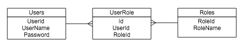

# 5. メンバーシップ フレームワークによる認証機能の実装 (後編)

## (1) ユーザーとロールの情報をデータベースで管理する

### Users, Rolesテーブルの追加

ユーザーとロールを管理するテーブルを作成します。

*User* と *Role* は 多対多の関係となるので
関連付けを管理する *UserRole* テーブルを作成します。



```sql
CREATE TABLE [dbo].[Users] (
  [UserId] INT IDENTITY (1, 1) NOT NULL,
  [UserName] NVARCHAR (200) NOT NULL,
  [Password] NVARCHAR (200) NOT NULL,
  PRIMARY KEY CLUSTERED ([UserId] ASC)
);

CREATE TABLE [dbo].[Roles] (
  [RoleId] INT IDENTITY (1, 1) NOT NULL,
  [RoleName] NVARCHAR (200) NOT NULL,
  PRIMARY KEY CLUSTERED ([RoleId] ASC)
);

CREATE TABLE [dbo].[UserRole] (
  [UserID] INT NOT NULL,
  [RoleID] INT NOT NULL,
  CONSTRAINT [FK_dbo.UserRole_dbo.User_UserID] FOREIGN KEY ([UserID])
    REFERENCES [dbo].[Users] ([UserID]) ON DELETE CASCADE,
  CONSTRAINT [FK_dbo.UserRole_dbo.Role_RoleID] FOREIGN KEY ([RoleID])
    REFERENCES [dbo].[Roles] ([RoleID]) ON DELETE CASCADE
);
```

<br><br>

### 初期データの登録

```sql
insert into dbo.Users ([UserName], [Password]) values ('administrator', 'password');
insert into dbo.Users ([UserName], [Password]) values ('user', 'password');
insert into dbo.Roles ([RoleName]) values ('Administrators');
insert into dbo.Roles ([RoleName]) values ('Users');

insert into dbo.UserRole ([UserId], [RoleId]) values (1, 1);
insert into dbo.UserRole ([UserId], [RoleId]) values (2, 2);
```


<br><br>

### EDMファイルの更新

`Models/DrugInfoContext.edmx` を開きます。
右クリックし *データベースからモデルを更新* を選択します。
*追加* タブで、 *テーブル* にチェックを入れ、 *完了* をクリックします。
デザイナーで、*Users* と *Roles* が表示されることを確認します。

<br><br>

### *MembershipProvider* の更新

`Models/CustomMembershipProvider.cs`

```cs
public override bool ValidateUser(string username, string password)
{
    using (var db = new DrugInfoContext())
    {
        var user = db.Users
            .Where(u => u.UserName.Equals(username) && u.Password.Equals(password))
            .FirstOrDefault();

        if (user != null)
        {
            // 認証OK
            return true;
        }
    }
    return false;
}
```

username, passwordを元にユーザーを取得します。

<br><br>

### *RoleProvider* の更新

`Models/CustomRoleProvider.cs`

```cs
public override string[] GetRolesForUser(string userId)
{
    using (var db = new DrugInfoContext())
    {
        int id = int.Parse(userId);
        var user = db.Users
            .Where(u => u.UserId == id)
            .FirstOrDefault();

        if (user != null) {
            string[] roles = user.Roles.Select(r => r.RoleName).ToArray();
            return roles;
        }
        return new string[] {};
    }
}
```

<br>

`GetRolesForUser` は、指定されたユーザーの所属するロールを配列で返します。

<br>

```cs
public override bool IsUserInRole(string userId, string roleName)
{
    using (var db = new DrugInfoContext())
    {
        int id = int.Parse(userId);
        var user = db.Users
            .Where(u => u.Id == id)
            .FirstOrDefault();

        if (user != null) {
            string[] roles = user.Roles.Select(r => r.RoleName).ToArray();

            if (roles.Contains(roleName))
            {
                return true;
            }
        }
    }

    return false;
}
```

<br>

`IsUserInRole` は、指定されたユーザーが該当のロールに所属しているかを判定するメソッドです。

ユーザーIDを元にユーザーを検索し、ユーザーが所属するロールをチェックしています。

<br><br>

### コントローラーの修正

`Controllers/LoginController.cs`

```cs
using System;
using System.Collections.Generic;
using System.Linq;
using System.Web;
using System.Web.Mvc;
using System.Web.Security;
using WebApplication1.Models;

namespace WebApplication1.Controllers
{
    [AllowAnonymous]
    public class LoginController : Controller
    {
        readonly CustomMembershipProvider membershipProvider = new CustomMembershipProvider();
        private DrugInfoContext db = new DrugInfoContext();

        // GET: Login
        public ActionResult Index()
        {
            return View();
        }

        // POST: Login
        [HttpPost]
        [ValidateAntiForgeryToken]
        public ActionResult Index([Bind(Include = "UserName,Password")] LoginViewModel model)
        {
            if (ModelState.IsValid)
            {
                if (this.membershipProvider.ValidateUser(model.UserName, model.Password))
                {
                    var user = db.Users.Where(u => u.UserName.Equals(model.UserName)
                        && u.Password.Equals(model.Password))
                        .FirstOrDefault();
                    FormsAuthentication.SetAuthCookie(user.UserId.ToString(), false);
                    return RedirectToAction("Index", "Home");
                }
            }
            ViewBag.Message = "ログインに失敗しました。";
            return View(model);
        }

        // GET: Login/SignOut
        public ActionResult SignOut()
        {
            FormsAuthentication.SignOut();
            return RedirectToAction("Index");
        }
    }
}
```

`FormsAuthentication.SetAuthCookie` で登録された値が
*RoleProvider* の `GetRolesForUser` や `IsUserInRole` で使用されますので
ユーザーを一意に特定できる `UserId` を保持するように修正します。

<br><br>

### 動作確認

* *administrator* でログイン
  - 薬効分類のリンクにアクセスできることを確認
* *user* でログイン
  - 薬効分類のリンクにアクセスするとログイン画面に戻ることを確認

<br><br>

## (2) ユーザー, ロールの管理画面の追加

### ControllerとViewの追加

*Users* と *Roles* を元に *Controller* と *View* を自動生成します。

また、それぞれAdministratorsロールに所属しているユーザーのみ表示できるようにします。

<br>

`Controllers/UsersController.cs`


<br>

`Controllers/RolesController.cs`

<br><br>

### コンボボックスの表示

ユーザー登録時に *Role* を選択できるようにコンボボックスを追加します。

`Controllers/UsersController.cs`

`Views/Users/Create.cshtml`

`Views/Users/Edit.cshtml`

<br><br>

### ナビゲーションバーにリンクを追加

`/Users/Index` と `/Roles/Index` に遷移するリンクをナビゲーションバーに追加します。

`Views/Shared/_Layout.cshtml`

```html
<ul class="nav navbar-nav">
    <li>
        @Html.ActionLink("薬効分類", "Index", new { Controller = "Classifications" })
    </li>
    <li>
        @Html.ActionLink("ユーザー管理", "Index", new { Controller = "Users" })
    </li>
    <li>
        @Html.ActionLink("ロール管理", "Index", new { Controller = "Roles" })
    </li>
</ul>
```

<br><br>

### 動作確認

新しいユーザーを追加して、作成したユーザーでログインしてみます。

<br><br>

## (3) ロールによって画面表示を切り替える

### Viewの修正

`_Layout.cshtml`

* 認証されていれば、以下のリンクを表示する
  - ログアウト
* Administratorsであれば、以下のリンクを表示する
  - 薬効分類
  - ユーザー管理
  - ロール管理

```html
@{
    ViewBag.ApplicationName = "薬品情報検索";
}
<!DOCTYPE html>
<html>
<head>
    <meta charset="utf-8" />
    <meta name="viewport" content="width=device-width, initial-scale=1.0">
    <title>@ViewBag.Title - @ViewBag.ApplicationName</title>
    <link href="~/Content/Site.css" rel="stylesheet" type="text/css" />
    <link href="~/Content/bootstrap.min.css" rel="stylesheet" type="text/css" />
    <script src="~/Scripts/modernizr-2.6.2.js"></script>
</head>
<body>
    <div class="navbar navbar-inverse navbar-fixed-top">
        <div class="container">
            <div class="navbar-header">
                <button type="button" class="navbar-toggle" data-toggle="collapse" data-target=".navbar-collapse">
                    <span class="icon-bar"></span>
                    <span class="icon-bar"></span>
                    <span class="icon-bar"></span>
                </button>
                @Html.ActionLink((string)ViewBag.ApplicationName, "Index", "Home", new { area = "" }, new { @class = "navbar-brand" })
            </div>
            @if (Request.IsAuthenticated)
            {
            <div class="navbar-collapse collapse">
                @if (User.IsInRole("Administrators"))
                {
                <ul class="nav navbar-nav">
                    <li>
                        @Html.ActionLink("薬効分類", "Index", new { Controller = "Classifications" })
                    </li>
                    <li>
                        @Html.ActionLink("ユーザー管理", "Index", new { Controller = "Users" })
                    </li>
                    <li>
                        @Html.ActionLink("ロール管理", "Index", new { Controller = "Roles" })
                    </li>
                </ul>
                }
                <p class="navbar-text navbar-right">
                    @Html.ActionLink("ログアウト", "SignOut", new { Controller = "Login" }, new { @class = "navbar-link" })
                </p>
            </div>
            }
        </div>
    </div>

    <div class="container body-content">
        @RenderBody()
        <hr />
        <footer>
            <p>&copy; @DateTime.Now.Year - @ViewBag.ApplicationName</p>
        </footer>
    </div>

    <script src="~/Scripts/jquery-1.10.2.min.js"></script>
    <script src="~/Scripts/bootstrap.min.js"></script>
</body>
</html>
```

Razorで認証情報を参照することができます。

認証しているかどうかは `Request.IsAuthenticated` で判定できます。

認証情報は `User` に格納されています。
`IsInRole` メソッドでログインしたユーザーが該当ロールに所属しているかどうかを判定できます。

<br><br>

### 動作確認

ログインするユーザーのロールによって、ナビゲーションバーのリンクが変わることを確認します。

<br><br>

------

<br>

メンバーシップフレームワークによるユーザー認証とロールによる権限制御について解説しました。

<br><br>
