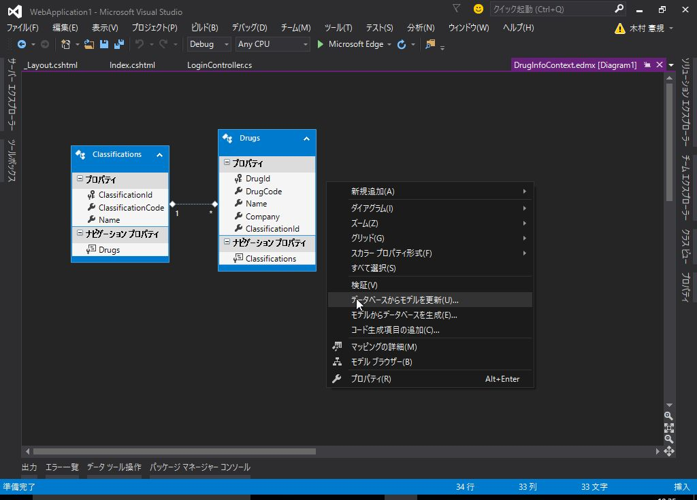
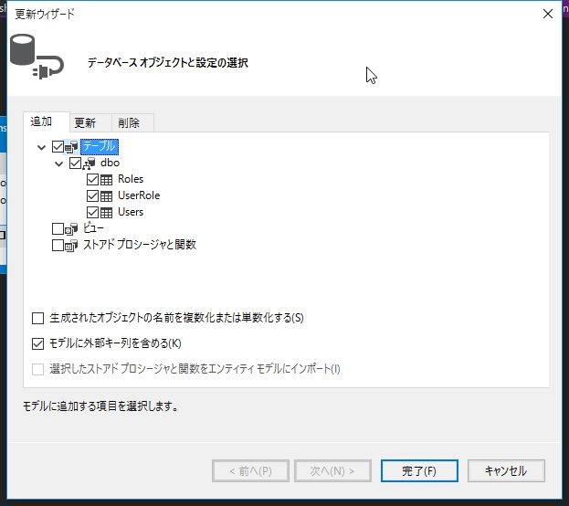

# 5. メンバーシップ フレームワークによる認証機能の実装 (後編)

## (1) ユーザーとロールの情報をデータベースで管理する

### Users, Rolesテーブルの追加

ユーザーとロールを管理するテーブルを作成します。

*User* と *Role* は 多対多の関係となるので
関連付けを管理する *UserRole* テーブルを作成します。


```sql
CREATE TABLE [dbo].[Users] (
  [UserId] INT IDENTITY (1, 1) NOT NULL,
  [UserName] NVARCHAR (200) NOT NULL,
  [Password] NVARCHAR (200) NOT NULL,
  PRIMARY KEY CLUSTERED ([UserId] ASC)
);

CREATE TABLE [dbo].[Roles] (
  [RoleId] INT IDENTITY (1, 1) NOT NULL,
  [RoleName] NVARCHAR (200) NOT NULL,
  PRIMARY KEY CLUSTERED ([RoleId] ASC)
);

CREATE TABLE [dbo].[UserRole] (
  [Id] INT IDENTITY (1, 1) NOT NULL,
  [UserID] INT NOT NULL,
  [RoleID] INT NOT NULL,
  PRIMARY KEY CLUSTERED ([Id] ASC),
  CONSTRAINT [FK_dbo.UserRole_dbo.User_UserID] FOREIGN KEY ([UserID])
    REFERENCES [dbo].[Users] ([UserID]) ON DELETE CASCADE,
  CONSTRAINT [FK_dbo.UserRole_dbo.Role_RoleID] FOREIGN KEY ([RoleID])
    REFERENCES [dbo].[Roles] ([RoleID]) ON DELETE CASCADE
);
```

<br><br>

### 初期データの登録

*administrator* と *user* というユーザーを作成します。

```sql
insert into dbo.Users ([UserName], [Password]) values ('administrator', 'password');
insert into dbo.Users ([UserName], [Password]) values ('user', 'password');
```

<br>

*Administrators* と *Users* というロールを作成します。

```sql
insert into dbo.Roles ([RoleName]) values ('Administrators');
insert into dbo.Roles ([RoleName]) values ('Users');
```

*administrator* と *Administrators* を、
*user* と *Users* を紐付けます。

```sql
insert into dbo.UserRole ([UserId], [RoleId]) values (1, 1);
insert into dbo.UserRole ([UserId], [RoleId]) values (2, 2);
```


<br><br>

### EDMファイルの更新

`Models/DrugInfoContext.edmx` を開きます。

右クリックし *データベースからモデルを更新* を選択します。



*追加* タブで、 *テーブル* にチェックを入れ、 *完了* をクリックします。



デザイナーで、*Users* と *Roles*, *UserRole* が表示されることを確認します。

<br><br>

### 補足説明: EDMファイルの削除と再作成

何らかの理由で EDMファイルをイチから再作成したい場合は、以下の手順で行います。

* *Models* から該当のedmxファイルを削除します。
* *Web.config* を開き、一番下にある `<connectionStrings>` を削除します。
  - `<add>` が複数ある場合は、`name` を元に削除対象のデータのみを削除します。
* edmxファイルを作成します。
  - *Models* を右クリック -> *追加* -> *新しい項目* を選択
  - *ADO.NET Entity Data Model* を選択
  - 名前を入力し、*追加* をクリック
  - ウィザードが起動するので、対象となるテーブルを選択して完了します。

<br><br>

### *MembershipProvider* の更新

`Models/CustomMembershipProvider.cs`

```cs
public override bool ValidateUser(string username, string password)
{
    using (var db = new DrugInfoContext())
    {
        var user = db.Users
            .Where(u => u.UserName.Equals(username) && u.Password.Equals(password))
            .FirstOrDefault();

        if (user != null)
        {
            // 認証OK
            return true;
        }
    }
    return false;
}
```

username, passwordを元にユーザーを取得します。

<br><br>

### *RoleProvider* の更新

`Models/CustomRoleProvider.cs`

```cs
public override string[] GetRolesForUser(string userId)
{
    using (var db = new DrugInfoContext())
    {
        int id = int.Parse(userId);
        var user = db.Users
            .Where(u => u.UserId == id)
            .FirstOrDefault();

        if (user != null) {
            string[] roles = user.UserRole.Select(item => item.Roles.RoleName).ToArray();
            return roles;
        }
        return new string[] {};
    }
}
```

<br>

`GetRolesForUser` は、指定されたユーザーの所属するロールを配列で返します。

<br>

```cs
public override bool IsUserInRole(string userId, string roleName)
{
    using (var db = new DrugInfoContext())
    {
        int id = int.Parse(userId);
        var user = db.Users
            .Where(u => u.UserId == id)
            .FirstOrDefault();

        if (user != null) {
            string[] roles = user.UserRole.Select(item => item.Roles.RoleName).ToArray();

            if (roles.Contains(roleName))
            {
                return true;
            }
        }
    }

    return false;
}
```

<br>

`IsUserInRole` は、指定されたユーザーが該当のロールに所属しているかを判定するメソッドです。

ユーザーIDを元にユーザーを検索し、ユーザーが所属するロールをチェックしています。

<br><br>

### コントローラーの修正

`Controllers/LoginController.cs`

```cs
using System;
using System.Collections.Generic;
using System.Linq;
using System.Web;
using System.Web.Mvc;
using System.Web.Security;
using WebApplication1.Models;

namespace WebApplication1.Controllers
{
    [AllowAnonymous]
    public class LoginController : Controller
    {
        readonly CustomMembershipProvider membershipProvider = new CustomMembershipProvider();
        private DrugInfoContext db = new DrugInfoContext();

        // GET: Login
        public ActionResult Index()
        {
            return View();
        }

        // POST: Login
        [HttpPost]
        [ValidateAntiForgeryToken]
        public ActionResult Index([Bind(Include = "UserName,Password")] LoginViewModel model)
        {
            if (ModelState.IsValid)
            {
                if (this.membershipProvider.ValidateUser(model.UserName, model.Password))
                {
                    var user = db.Users.Where(u => u.UserName.Equals(model.UserName)
                        && u.Password.Equals(model.Password))
                        .FirstOrDefault();

                    if (user != null) {
                        FormsAuthentication.SetAuthCookie(user.UserId.ToString(), false);
                        return RedirectToAction("Index", "Home");
                    }
                }
            }
            ViewBag.Message = "ログインに失敗しました。";
            return View(model);
        }

        // GET: Login/SignOut
        public ActionResult SignOut()
        {
            FormsAuthentication.SignOut();
            return RedirectToAction("Index");
        }
    }
}
```

`FormsAuthentication.SetAuthCookie` で登録された値が
*RoleProvider* の `GetRolesForUser` や `IsUserInRole` で使用されますので
ユーザーを一意に特定できる `UserId` を保持するように修正します。

<br><br>

### 動作確認

* *administrator* でログイン
  - 薬効分類のリンクにアクセスできることを確認
* *user* でログイン
  - 薬効分類のリンクにアクセスするとログイン画面に戻ることを確認

<br><br>

## (2) ユーザー, ロールの管理画面の追加

### ControllerとViewの追加

*Users* と *Roles* を元に *Controller* と *View* を自動生成します。

* *ソリューション エクスプローラー* で *Controllers* を右クリック
* *追加* -> *新しいスキャフォールディングアイテム* を選択
* *Entity Framework を使用した、ビューがある MVC 5 コントローラー* を選択して *追加* をクリック
* *モデルクラス*、 *データコンテキストクラス* を選択して *追加* をクリック

<br>

それぞれAdministratorsロールに所属しているユーザーのみ表示できるようにします。

<br>

`Controllers/UsersController.cs`

```cs
using System.Data.Entity;
using System.Linq;
using System.Net;
using System.Web.Mvc;
using WebApplication1.Models;

namespace WebApplication1.Controllers
{
    [Authorize(Roles = "Administrators")]
    public class UsersController : Controller
    {
      /* ~~ 省略 ~~ */
    }
}
```

<br>

`Controllers/RolesController.cs`

```cs
using System.Data.Entity;
using System.Linq;
using System.Net;
using System.Web.Mvc;
using WebApplication1.Models;

namespace WebApplication1.Controllers
{
    [Authorize(Roles = "Administrators")]
    public class RolesController : Controller
    {
      /* ~~ 省略 ~~ */
    }
}
```

<br><br>

### Usersモデルの修正

```cs
using System.Collections.Generic;
using System.ComponentModel;
using System.ComponentModel.DataAnnotations;
using System.ComponentModel.DataAnnotations.Schema;

namespace WebApplication1.Models
{
    [MetadataType(typeof(UsersMetadata))]
    public partial class Users
    {
        [Required]
        [NotMapped]
        [DisplayName("ロール")]
        public List<int> RoleId { get; set; }
    }

    public class UsersMetadata
    {
        public int UserId { get; set; }

        [Required]
        public string UserName { get; set; }

        [Required]
        public string Password { get; set; }
    }
}
```

<br><br>

### リストボックスの表示と更新処理の修正

以下の点について、追加・修正します。

* ユーザー登録・更新時に *Role* を選択できるようにリストボックスを追加します。
* `Create`, `Update` について *POST* されてきた際に、選択された *Role* を反映するよう修正します。

`Controllers/UsersController.cs`

```cs
using System.Collections.Generic;
using System.Data;
using System.Data.Entity;
using System.Linq;
using System.Net;
using System.Web.Mvc;
using WebApplication1.Models;

namespace WebApplication1.Controllers
{
    public class UsersController : Controller
    {

        /* ~~ 省略 ~~ */

        // GET: Users/Create
        public ActionResult Create()
        {
            this.SetRoleItems();
            return View();
        }

        // POST: Users/Create
        // 過多ポスティング攻撃を防止するには、バインド先とする特定のプロパティを有効にしてください。
        // 詳細については、http://go.microsoft.com/fwlink/?LinkId=317598 を参照してください。
        [HttpPost]
        [ValidateAntiForgeryToken]
        public ActionResult Create([Bind(Include = "UserId,UserName,Password,RoleId")] Users users)
        {
            if (ModelState.IsValid)
            {
                foreach(int roleId in users.RoleId)
                {
                    var userRole = new UserRole
                    {
                        UserID = users.UserId,
                        RoleID = roleId
                    };
                    users.UserRole.Add(userRole);
                }

                db.Users.Add(users);
                db.SaveChanges();
                return RedirectToAction("Index");
            }

            this.SetRoleItems();
            return View(users);
        }

        // GET: Users/Edit/5
        public ActionResult Edit(int? id)
        {
            if (id == null)
            {
                return new HttpStatusCodeResult(HttpStatusCode.BadRequest);
            }
            Users users = db.Users.Find(id);
            if (users == null)
            {
                return HttpNotFound();
            }
            var roles = users.UserRole.Select(item => item.Roles).ToList();
            this.SetRoleItems(roles);
            return View(users);
        }

        // POST: Users/Edit/5
        // 過多ポスティング攻撃を防止するには、バインド先とする特定のプロパティを有効にしてください。
        // 詳細については、http://go.microsoft.com/fwlink/?LinkId=317598 を参照してください。
        [HttpPost]
        [ValidateAntiForgeryToken]
        public ActionResult Edit([Bind(Include = "UserId,UserName,Password,RoleId")] Users users)
        {
            if (ModelState.IsValid)
            {
                db.Entry(users).State = EntityState.Modified;

                var roleIds = db.UserRole
                    .Where(item => item.UserID == users.UserId)
                    .Select(item => item.RoleID)
                    .ToList();

                foreach (int roleId in users.RoleId)
                {
                    if (db.UserRole
                        .Where(item => item.UserID == users.UserId && item.RoleID == roleId)
                        .Count() > 0)
                    {
                        // 既に登録済み
                        roleIds.Remove(roleId);
                    }
                    else
                    {
                        // 追加
                        var userRole = new UserRole
                        {
                            UserID = users.UserId,
                            RoleID = roleId
                        };
                        db.UserRole.Add(userRole);
                    }
                }

                // 削除されたロールをDBに反映
                foreach(var roleId in roleIds)
                {
                    var item = db.UserRole.Where(ur => ur.UserID == users.UserId && ur.RoleID == roleId).FirstOrDefault();
                    if (item != null)
                    {
                        db.UserRole.Remove(item);
                    }
                }

                db.SaveChanges();
                return RedirectToAction("Index");
            }
            return View(users);
        }

        /* ~~ 省略 ~~ */

        /// <summary>
        /// ロールのリストをViewBagにセット
        /// </summary>
        private void SetRoleItems()
        {
            SetRoleItems(new List<Roles>());
        }

        /// <summary>
        /// ロールのリストをViewBagにセット
        /// </summary>
        /// <param name="roleId"></param>
        private void SetRoleItems(List<Roles> roles)
        {
            var roleIds = roles.Select(item => item.RoleId).ToArray();

            var list = db.Roles.Select(item => new SelectListItem
            {
                Text = item.RoleName,
                Value = item.RoleId.ToString(),
                Selected = roleIds.Contains(item.RoleId)
            }).ToList();

            ViewBag.RoleId = list;
        }
    }
}
```

<br>

`Views/Users/Create.cshtml`

```html
@model WebApplication1.Models.Users

@{
    ViewBag.Title = "Create";
}

<h2>Create</h2>


@using (Html.BeginForm())
{
    @Html.AntiForgeryToken()

    <div class="form-horizontal">
        <h4>Users</h4>
        <hr />
        @Html.ValidationSummary(true, "", new { @class = "text-danger" })
        <div class="form-group">
            @Html.LabelFor(model => model.UserName, htmlAttributes: new { @class = "control-label col-md-2" })
            <div class="col-md-10">
                @Html.EditorFor(model => model.UserName, new { htmlAttributes = new { @class = "form-control" } })
                @Html.ValidationMessageFor(model => model.UserName, "", new { @class = "text-danger" })
            </div>
        </div>

        <div class="form-group">
            @Html.LabelFor(model => model.Password, htmlAttributes: new { @class = "control-label col-md-2" })
            <div class="col-md-10">
                @Html.PasswordFor(model => model.Password, new { @class = "form-control" })
                @Html.ValidationMessageFor(model => model.Password, "", new { @class = "text-danger" })
            </div>
        </div>

        <div class="form-group">
            @Html.LabelFor(model => model.RoleId, htmlAttributes: new { @class = "control-label col-md-2" })
            <div class="col-md-10">
                @Html.ListBox("RoleId", null, new { @class = "form-control" })
                @Html.ValidationMessageFor(model => model.RoleId, "", new { @class = "text-danger" })
            </div>
        </div>

        <div class="form-group">
            <div class="col-md-offset-2 col-md-10">
                <input type="submit" value="Create" class="btn btn-default" />
            </div>
        </div>
    </div>
}

<div>
    @Html.ActionLink("Back to List", "Index")
</div>

<script src="~/Scripts/jquery-1.10.2.min.js"></script>
<script src="~/Scripts/jquery.validate.min.js"></script>
<script src="~/Scripts/jquery.validate.unobtrusive.min.js"></script>
```

* EditorFor -> PasswordFor に変更
* [ListBox](https://msdn.microsoft.com/ja-jp/library/system.web.mvc.html.selectextensions.listbox.aspx)

<br>

`Views/Users/Edit.cshtml`

```html
@model WebApplication1.Models.Users

@{
    ViewBag.Title = "Edit";
}

<h2>Edit</h2>


@using (Html.BeginForm())
{
    @Html.AntiForgeryToken()

    <div class="form-horizontal">
        <h4>Users</h4>
        <hr />
        @Html.ValidationSummary(true, "", new { @class = "text-danger" })
        @Html.HiddenFor(model => model.UserId)

        <div class="form-group">
            @Html.LabelFor(model => model.UserName, htmlAttributes: new { @class = "control-label col-md-2" })
            <div class="col-md-10">
                @Html.EditorFor(model => model.UserName, new { htmlAttributes = new { @class = "form-control" } })
                @Html.ValidationMessageFor(model => model.UserName, "", new { @class = "text-danger" })
            </div>
        </div>

        <div class="form-group">
            @Html.LabelFor(model => model.Password, htmlAttributes: new { @class = "control-label col-md-2" })
            <div class="col-md-10">
                @Html.EditorFor(model => model.Password, new { htmlAttributes = new { @class = "form-control" } })
                @Html.ValidationMessageFor(model => model.Password, "", new { @class = "text-danger" })
            </div>
        </div>

        <div class="form-group">
            @Html.LabelFor(model => model.RoleId, htmlAttributes: new { @class = "control-label col-md-2" })
            <div class="col-md-10">
                @Html.ListBox("RoleId", null, new { @class = "form-control" })
                @Html.ValidationMessageFor(model => model.RoleId, "", new { @class = "text-danger" })
            </div>
        </div>

        <div class="form-group">
            <div class="col-md-offset-2 col-md-10">
                <input type="submit" value="Save" class="btn btn-default" />
            </div>
        </div>
    </div>
}

<div>
    @Html.ActionLink("Back to List", "Index")
</div>

<script src="~/Scripts/jquery-1.10.2.min.js"></script>
<script src="~/Scripts/jquery.validate.min.js"></script>
<script src="~/Scripts/jquery.validate.unobtrusive.min.js"></script>
```

<br><br>

### ナビゲーションバーにリンクを追加

`/Users/Index` と `/Roles/Index` に遷移するリンクをナビゲーションバーに追加します。

`Views/Shared/_Layout.cshtml`

```html
<ul class="nav navbar-nav">
    <li>
        @Html.ActionLink("薬効分類", "Index", new { Controller = "Classifications" })
    </li>
    <li>
        @Html.ActionLink("ユーザー管理", "Index", new { Controller = "Users" })
    </li>
    <li>
        @Html.ActionLink("ロール管理", "Index", new { Controller = "Roles" })
    </li>
</ul>
```

<br><br>

### 動作確認

新しいユーザーを追加して、作成したユーザーでログインしてみます。

<br><br>

## (3) ロールによって画面表示を切り替える

### Viewの修正

`_Layout.cshtml`

* 認証されていれば、以下のリンクを表示する
  - ログアウト
* Administratorsであれば、以下のリンクを表示する
  - 薬効分類
  - ユーザー管理
  - ロール管理

```html
@{
    ViewBag.ApplicationName = "薬品情報検索";
}
<!DOCTYPE html>
<html>
<head>
    <meta charset="utf-8" />
    <meta name="viewport" content="width=device-width, initial-scale=1.0">
    <title>@ViewBag.Title - @ViewBag.ApplicationName</title>
    <link href="~/Content/Site.css" rel="stylesheet" type="text/css" />
    <link href="~/Content/bootstrap.min.css" rel="stylesheet" type="text/css" />
    <script src="~/Scripts/modernizr-2.6.2.js"></script>
</head>
<body>
    <div class="navbar navbar-inverse navbar-fixed-top">
        <div class="container">
            <div class="navbar-header">
                <button type="button" class="navbar-toggle" data-toggle="collapse" data-target=".navbar-collapse">
                    <span class="icon-bar"></span>
                    <span class="icon-bar"></span>
                    <span class="icon-bar"></span>
                </button>
                @Html.ActionLink((string)ViewBag.ApplicationName, "Index", "Home", new { area = "" }, new { @class = "navbar-brand" })
            </div>
            @if (Request.IsAuthenticated)
            {
            <div class="navbar-collapse collapse">
                @if (User.IsInRole("Administrators"))
                {
                <ul class="nav navbar-nav">
                    <li>
                        @Html.ActionLink("薬効分類", "Index", new { Controller = "Classifications" })
                    </li>
                    <li>
                        @Html.ActionLink("ユーザー管理", "Index", new { Controller = "Users" })
                    </li>
                    <li>
                        @Html.ActionLink("ロール管理", "Index", new { Controller = "Roles" })
                    </li>
                </ul>
                }
                <p class="navbar-text navbar-right">
                    @Html.ActionLink("ログアウト", "SignOut", new { Controller = "Login" }, new { @class = "navbar-link" })
                </p>
            </div>
            }
        </div>
    </div>

    <div class="container body-content">
        @RenderBody()
        <hr />
        <footer>
            <p>&copy; @DateTime.Now.Year - @ViewBag.ApplicationName</p>
        </footer>
    </div>

    <script src="~/Scripts/jquery-1.10.2.min.js"></script>
    <script src="~/Scripts/bootstrap.min.js"></script>
</body>
</html>
```

Razorで認証情報を参照することができます。

認証しているかどうかは `Request.IsAuthenticated` で判定できます。

認証情報は `User` に格納されています。
`IsInRole` メソッドでログインしたユーザーが該当ロールに所属しているかどうかを判定できます。

<br><br>

### 動作確認

ログインするユーザーのロールによって、ナビゲーションバーのリンクが変わることを確認します。

<br><br>

------

<br>

メンバーシップフレームワークによるユーザー認証とロールによる権限制御について解説しました。

[次へ](./asp-303.html)

<br><br>
