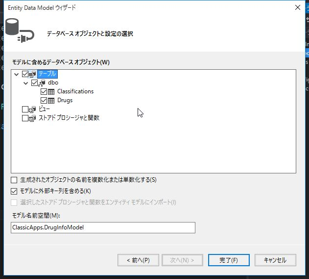
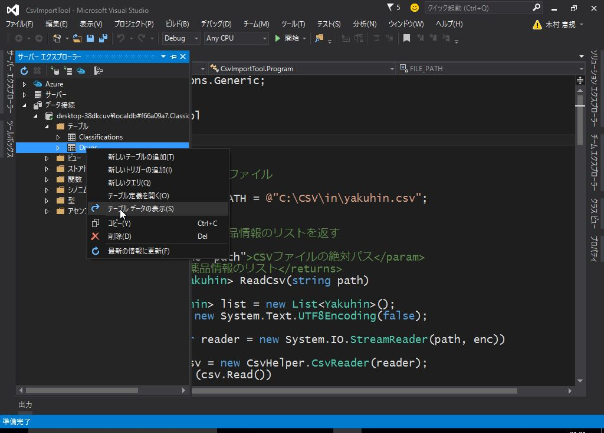

# 1. 簡単なコンソールアプリケーションの開発

GUIのないコンソールアプリケーションの作成を通して、 *Entity Framework* を使用した
データベースのデータ登録、参照、更新、削除の操作 (Create, Read, Update, Delete *CRUD*) について解説します。

<br>

### 用語解説: Entity Framework

*Entity Framework* は、.NET 開発者がオブジェクトを使用して
リレーショナル データを処理できるようにする *オブジェクト リレーショナル マッパー* (O/Rマッパー) です。

* 参考: [Entity Framework](https://msdn.microsoft.com/ja-jp/data/ef.aspx)

<br>

### 用語解説: O/Rマッパー

* O/Rマッピング ... オブジェクトの各プロパティを、RDBのテーブルの各フィールドに関連付けること。
* O/Rマッパー ... O/Rマッピングを行うライブラリのこと。

O/Rマッパーによって オブジェクト と テーブル を紐付け、オブジェクトに対する操作を行うと
背後でO/RマッパーがSQL文を発行して処理を行ってくれるため、SQLを直接扱う場面が減り、
プログラムの見通しがよくなります。

<br>
<br>

## アプリケーション仕様


<br>

CSVファイルを取り込み、SQL Serverに取り込むアプリケーションを作成します。

<br><br>

## データの準備

### CSVファイル

以下の項目がカンマ区切りで記載されているCSVファイルを作成します。

* 薬品コード
* 薬効分類コード
* 薬効名 (薬効分類コードに対応した名称)
* 医薬品名
* 会社名

<br>

サンプルデータを用意していますので、[こちら <i class="fa fa-file"></i>](./yakuhin.csv) をダウンロードしてください。

`C:¥CSV¥in` に `yakuhin.csv` として保存します。
文字コードは *Shift_JIS* としてください。

<br><br>

### データベース

薬品情報を格納するテーブルを準備します。

薬効分類を管理する *Classifications* テーブルと、薬品情報を管理する *Drugs* テーブルを用意します。


<br>

#### SQL Server LocalDB のサーバー名を確認する

Visual Studio 2012 以降の場合、 *SQL Server LocalDB* がインストールされています。
(VS2015では明示的に選択する必要があるかもしれません。)

バージョンによってサーバー名が異なりますので、以下の手順で確認します。  
(SQL Server Express を使用している場合は `.\SQLEXPRESS` 固定です。)

<br>

(1) コマンドプロンプトを実行します。

(2) `sqllocaldb i` と入力し、Enterキーを押します。

以下のように、サーバー名が表示されます。

```
C:¥Users¥{UserName}>sqllocaldb i
MSSQLLocalDB
```

<br>

コマンドが存在しない場合、*SQL Server LocalDB* がインストールされていません。  
Visual Studio のインストーラーを再実行して、*Microsoft SQL Server Data Tools* にチェックが入っている事を確認してください。


<br>
<br>

#### SQL Server にデータベースを作成する

(1) Visual Studio を起動します。

(2) *サーバー エクスプローラー* を表示します。


<br>

(3) *データ接続* を右クリックし、 *接続の追加* を選択します。


<br>

(4) *サーバー名* にデータベースのサーバー名を入力します。

* *SQL Server Express* の場合: `.\SQLEXPRESS`
* *SQL Server LocalDB* の場合: `(localdb)¥{ServerName}`  
{ServerName} には 上の手順で確認したサーバー名を設定

(5) *データベース名の選択または入力* にデータベース名を入力します。  
今回は `ClassicApps.DrugInfo` とします。

<br>

(6) *データ接続* の下にデータベースが登録されます。  
右クリックし、*新しいクエリ* を選択します。

(7) 以下のSQLを入力します。

```sql
CREATE TABLE [dbo].[Classifications] (
  [ClassificationId] INT IDENTITY (1, 1) NOT NULL,
  [ClassificationCode] NVARCHAR (3) NOT NULL,
  [Name] NVARCHAR (200) NULL,
  CONSTRAINT [PK_dbo.Classifications] PRIMARY KEY CLUSTERED ([ClassificationId] ASC)
);

CREATE TABLE [dbo].[Drugs] (
  [DrugId] INT IDENTITY (1, 1) NOT NULL,
  [DrugCode] NVARCHAR (12) NULL,
  [Name] NVARCHAR (200) NULL,
  [Company] NTEXT NULL,
  [ClassificationId] INT NOT NULL,
  CONSTRAINT [PK_dbo.Drugs] PRIMARY KEY CLUSTERED ([DrugId] ASC),
  CONSTRAINT [FK_dbo.Drugs_dbo.Classifications_ClassificationId] FOREIGN KEY ([ClassificationId]) REFERENCES [dbo].[Classifications] ([ClassificationId]) ON DELETE CASCADE
);
```

<br>


<br>

(8) *実行* をクリックします。  
`Classifications`, `Drugs` というテーブルが作成されていることを確認します。


<br><br>

------

<br><br>

## コンソールアプリケーション プロジェクトの作成

(1) 「スタート ページ」で *新しいプロジェクト* をクリックします。


スタートページを閉じてしまった場合は、「ファイル」メニューから新しいプロジェクトを選択します。

(2) 「新しいプロジェクト」のウィンドウで、左のツリーから *Visual C#* -> *Windows* の順にたどります。

(3) 右側で *コンソール アプリケーション* を選択します。

(4) 名前を *CsvImportTool* とし、*OK* をクリックします。

(任意の名前でも構いませんが、以降のソースコードで `namespace` の箇所をプロジェクト名に合わせる必要が出てきます。)


<br>

### Hello, World!

まずは、簡単なコードを書いて実行してみます。

```cs
using System;
using System.Collections.Generic;
using System.Linq;
using System.Text;
using System.Threading.Tasks;

namespace CsvImportTool
{
    class Program
    {
        static void Main(string[] args)
        {
            // コンソールに出力
            System.Console.WriteLine("Hello, World!");

            /*
              出力ウィンドウに出力
             */
            System.Diagnostics.Debug.WriteLine("Hello, World!");
        }
    }
}
```

<br><br>

コードを書いたら、*F5* キーを押すか、 *開始* (緑の三角形アイコン)をクリックします。

ビルドが完了すると、一瞬コマンド プロンプトが表示され、すぐに閉じられます。

Visual Studio の下部にある *出力ウィンドウ* を開くと、"Hello, World!" と出力されていることを確認してください。

<br>

```cs
System.Console.WriteLine("Hello, World!");
```

この行は、コンソール (コマンド プロンプト) に "Hello, World!" という文字列を出力する命令です。

`System` は名前空間(Namespace) です。  
上記のソースコードでは [using ディレクティブ](https://msdn.microsoft.com/ja-jp/library/sf0df423.aspx) に
`using System;` の記載があるので省略可能ですが、説明のために あえて記述しています。

[Console クラス](https://msdn.microsoft.com/ja-jp/library/system.console.aspx) は コンソール アプリケーションが標準入力・標準出力・標準エラーを使用するのに使用します。

[WriteLine メソッド](https://msdn.microsoft.com/ja-jp/library/xf2k8ftb.aspx) は
指定された文字列を標準出力に書き込み、続けて改行を書き込みます。

<br>

```cs
System.Diagnostics.Debug.WriteLine("Hello, World!");
```

この行は、Visual Studio の出力ウィンドウに文字列を出力します。

Debugクラスの出力は、 *Debug* のビルド時にのみ有効です。  
*Release* を指定した場合は無視されます。

参考: [Visual C# でトレースとデバッグを実行する方法](https://support.microsoft.com/ja-jp/kb/815788)

<br>

デバッグ目的でのメッセージ出力には `Debug` クラスを、
ユーザーに何か通知したい場合は `Console` クラスを使用します。

<br><br>

------

### 用語解説: 名前空間 (Namespace)

> [名前空間とは](http://d.hatena.ne.jp/keyword/%CC%BE%C1%B0%B6%F5%B4%D6)
>
> シンボル名 (変数名やメソッド名，クラス名等) が使用している複数のライブラリ等でぶつかってしまい支障があるような状況、
> 所謂 "名前の衝突" と呼ばれる状況を避ける目的で良く使われる。
>
> 名前空間というのは、一般的には、中に同じ名前のものが複数存在しないように分けたもののことである。  
> ある名前空間の中では、名前から特定のものを一意に決定できる。
> 別の名前空間内にあるものは、名前空間と名前を組み合わせることで一意に特定できる。

参考: [名前空間の名前](https://msdn.microsoft.com/ja-jp/library/ms229026.aspx)

<br>

------

<br>
<br>

## CSVの読み込み処理

CSVの内容を文字列として取り出すコードを書いていきます。

今回は、CSVの読み込みに *CsvHelper* というオープンソースのライブラリを使用します。

- [CsvHelper](http://joshclose.github.io/CsvHelper/)

<br>
<br>

------

### 用語解説: NuGet

Visual Studio用のパッケージ管理システムです。  
rubyのgemやpythonのpipのようなツールになります。

インターネット上で公開されている NuGet のレポジトリに登録されたライブラリなどをダウンロードし、
自分のプロジェクト内で利用できるようインストールしたり、不要なものをアンインストールするといった事ができます。

コマンドラインやPowerShellからも利用可能ですが、今回は Visual Studio が用意している GUI で操作します。

------

<br><br>

(1) *ソリューション エクスプローラー* をクリックします。

(2) プロジェクト名 *CsvImportTool* を右クリックし、 *NuGetパッケージの管理* をクリックします。


<br>

(3) *CsvHelper* を検索し、 *インストール* をクリックします。


<br>
注意: この画面は Visual Studio のバージョンによって大きく異なります。

<br>

(4) 続けて *変更の確認* ウィンドウが表示されるので、 *OK* をクリックします。


<br>

必要なモジュールがダウンロードされ、プロジェクトに組み込まれます。

<br><br>

### CSV読み込み処理

それでは、冒頭に作成したCSVファイルを読み込み、出力ウィンドウに内容を表示してみます。

<br>

```cs
using System;
using System.Collections.Generic;
using System.Linq;
using System.Text;
using System.Threading.Tasks;

namespace CsvImportTool
{
    class Program
    {
        /// <summary>
        /// 取り込み対象のCSVファイル
        /// </summary>
        const string FILE_PATH = @"C:\CSV\in\yakuhin.csv";

        static void Main(string[] args)
        {
            System.Diagnostics.Debug.WriteLine("Start");

            // var enc = new System.Text.UTF8Encoding(false); // UTF-8(BOM無し)の場合
            var enc = System.Text.Encoding.GetEncoding("shift_jis"); // Shift_JISの場合

            using (var reader = new System.IO.StreamReader(FILE_PATH, enc))
            {
                var csv = new CsvHelper.CsvReader(reader);
                while (csv.Read())
                {
                    string drugCode = csv.GetField<string>(0);
                    string clsCode = csv.GetField<string>(1);
                    string clsName = csv.GetField<string>(2);
                    string drugName = csv.GetField<string>(3);
                    string company = csv.GetField<string>(4);

                    string msg = string.Format("{0}, {1}, {2}, {3}, {4}",
                        drugCode, clsCode, clsName, drugName, company);

                    System.Diagnostics.Debug.WriteLine(msg);
                }
            }

            System.Diagnostics.Debug.WriteLine("End");
        }
    }
}
```

<br>

コードを記載したら、「開始」をクリックしてデバッグ実行してください。

出力ウィンドウにCSVの中身が表示されることを確認します。

<br>

#### ドキュメント コメント

コード ブロックの直前の特別なコメント フィールド (`///`) に XML要素を配置することで、コードのドキュメントを作成できます。

ドキュメント コメントを設定しておくと、Visual Studioで該当のメソッドなどにマウスオーバーした際にコメントが表示されるので
多人数で開発する際は非常に便利です。

定数やクラス、メソッドには必ず記載するようにしましょう。

- [XML ドキュメント コメント (C# プログラミング ガイド)](https://msdn.microsoft.com/ja-jp/library/b2s063f7.aspx)

<br>

#### <i class="fa fa-hand-o-right"></i> 定数

定数は `const` を付けて定義します。  
慣習的に、すべて大文字とし、単語の区切りはアンダースコア `_` とします。

<br>

#### <i class="fa fa-hand-o-right"></i> ファイルの読み込み

```cs
var reader = new System.IO.StreamReader(FILE_PATH, enc)
```

ファイルを読み取り専用で開きます。

第2引数には文字コードを指定します。  
例えば Shift_JIS の場合は、以下のように指定します。

```cs
var enc = System.Text.Encoding.GetEncoding("shift_jis");
```

他の文字コードを使用する場合は、参考サイトを御覧ください。

* 参考
  - [目的の文字コードに合ったEncodingオブジェクトを取得する](http://dobon.net/vb/dotnet/string/getencodingobject.html)
  - [readfile](http://dobon.net/vb/dotnet/file/readfile.html)

<br>

#### <i class="fa fa-hand-o-right"></i> usingステートメント

CSVファイルの読み込み箇所は、 *usingステートメント* で囲っています。

> [Dispose、Closeが確実に呼び出されるようにする](http://dobon.net/vb/dotnet/beginner/calldispose.html)
>
> usingステートメントでは、IDisposeインターフェイスが実装されているクラスのDisposeメソッドが呼び出されることを保障します。

ここでは、読み取り専用で開いたCSVファイルが確実に Close されるように usingステートメントを使用しています。

参考: [using ステートメント (C# リファレンス)](https://msdn.microsoft.com/ja-jp/library/yh598w02.aspx)

<br>

using の内側は、NuGetでインストールした *CsvHelper* を使用してCSVファイルを読み込んでいます。

```cs
string drugCode = csv.GetField<string>(0);
```

`GetField<string>` は *ジェネリック メソッド* と呼ばれ、型をメソッドの引数として指定します。

ここでは、`string` 型で値を取得しています。

参考: [ジェネリック (C# プログラミング ガイド)](https://msdn.microsoft.com/ja-jp/library/512aeb7t.aspx)

<br>

#### <i class="fa fa-hand-o-right"></i> 文字列の定義

文字列の定義には `@"..."` と頭に `@` を付ける方法と、付けない方法の2つがあります。

`@` を付けた場合、その中身は `¥` や改行なども含めてそのまま文字列として扱われます。

付けなかった場合は `¥` はエスケープシーケンスとなるので、`¥` は `¥¥`、改行は `¥n` とする必要があります。

ファイルパスを表す場合やSQL文を記述する場合は `@`を付けて定義するようにし、通常の文字列は付けないで定義します。

<br><br>

------

<br>

## データベースの書き込み処理

データベースへの登録処理を実装していきます。

今回はテーブルを先に作成済みなので、 *データベース・ファースト* と呼ばれる手法で開発していきます。

<br><br>

### 用語解説: Entity Data Model (edmxファイル)

データ構造を定義するファイル。

*CSDL (概念スキーマ定義言語)* , *SSDL (ストア・スキーマ定義言語)* , *MSL (マッピング・スキーマ言語)* という
3つのXMLファイルで構成されています。

実際にXMLを記述する必要はなく、データベースから自動生成する (データベース・ファースト) か、
*Entity Data Model Designer* を使用して作成 (モデル・ファースト) します。

<br><br>

### 最新の Entity Framework の入手

*CsvHelper* をインストールしたのと同じ手順で、 *Entity Framework* をインストールします。

(1) *ソリューション エクスプローラー* をクリックします。

(2) プロジェクト名 *CsvImportTool* を右クリックし、 *NuGetパッケージの管理* をクリックします。

(3) *Entity Framework* を検索し、 *インストール* をクリックします。

(4) 続けて *変更の確認* ウィンドウが表示されるので、 *OK* をクリックします。

<br><br>

### ADO.NET Entity Data Model の作成

(1) *ソリューション エクスプローラー* をクリックします。

(2) プロジェクト名 (CsvImportTool) を右クリックし、*追加* -> *新しい項目* をクリックします。


<br>

(3) *データ* から *ADO.NET Entity Data Model* を選択し、名前を `DrugInfoModel` とします。


<br>

(4) *データベースから EF Designer* を選択し、 *次へ* をクリックします。


<br>

(5) 作成したサーバーが選択されていることを確認します。

(6) *接続設定に名前を付けて App.Config に保存* にチェックをし、 `DrugInfoContext` と入力して *次へ* をクリックします。


<br>

(7) バージョンの選択ウィンドウが表示される場合は、 *Entity Framework 6.x* を選択して *次へ* をクリックします。


<br>

(8) *テーブル* にチェックを入れて *完了* をクリックします。


<br>

(9) *セキュリティ警告* が表示される場合は、 *今後このメッセージを表示しない* にチェックし、 *OK* をクリックします。


<br>

(10) edmxファイルが生成され、デザイナーに取り込まれたテーブルの情報が表示されます。


<br>
<br>

edmxファイルの動作確認も兼ねて、プログラムからデータベースにデータを登録してみます。

<br>

```cs
using System;
using System.Collections.Generic;
using System.Linq;
using System.Text;
using System.Threading.Tasks;

namespace CsvImportTool
{
    class Program
    {
        static void Main(string[] args)
        {
            System.Diagnostics.Debug.WriteLine("Start");

            // テスト用データ
            // 1112700X1038,111,全身麻酔剤,フローセン,武田薬品工業
            using (var db = new DrugInfoContext())
            {
                var classification = new Classifications
                {
                    ClassificationCode = "111",
                    Name = "全身麻酔剤"
                };
                db.Classifications.Add(classification);

                var drug = new Drugs
                {
                    DrugCode = "1112700X1038",
                    Name = "フローセン",
                    Company = "武田薬品工業",
                    ClassificationId = classification.ClassificationId
                };
                db.Drugs.Add(drug);

                db.SaveChanges();
            }

            System.Diagnostics.Debug.WriteLine("End");
        }
    }
}
```

CSVの1行目に記載したデータをデータベースに登録するコードです。

<br>

```cs
var db = new DrugInfoContext()
```

*Contextクラス* はデータベースへの接続を管理します。

データベースへのデータの登録や読み込みはすべて Contextクラスを通して行います。

<br>

まずは薬効分類を登録します。

```cs
var classification = new Classifications
{
    ClassificationCode = "111",
    Name = "全身麻酔剤"
};
db.Classifications.Add(classification);
```

`db.Classifications` は データベースの `Classifications` テーブルにひも付きます。

`Add` メソッドで、新しい薬効分類を登録します。  
特にコーディングしていませんが、このタイミングで `ClassificationId` が採番され、 `classification.ClassificationId` にセットされます。

<br>

`new` の後に `{}` で初期値を設定しています。  
これは以下とほぼ同じ意味です。

```cs
var classification = new Classifications();
classification.ClassificationCode = "111";
classification.Name = "全身麻酔剤";
```

<br>

続いて薬品情報を登録します。

```cs
var drug = new Drugs
{
    DrugCode = "1112700X1038",
    Name = "フローセン",
    Company = "武田薬品工業",
    ClassificationId = classification.ClassificationId
};
db.Drugs.Add(drug);
```

`ClassificationId = classification.ClassificationId` で薬効分類と薬品情報をひも付けています。

<br>

最後に、データベースに変更を反映させます。

```cs
db.SaveChanges();
```

<br><br>

コードを記載したら、「開始」をクリックしてデバッグ実行します。

プログラムが終了したら、 *サーバー エクスプローラー* でデータを確認してみてください。

<br><br>

------

<br>

## プログラムを完成させる

これまでの内容を組み合わせて、プログラムを完成させます。

少し詳細な仕様について、検討してみましょう。

* CSVを読み込み、リストに格納する
* 読み込んだデータを元に、データベースに薬効分類、薬品情報を登録する
  - すでに登録済みの内容についてはスキップする

<br><br>

### POCOの作成

CSVから読み込んだデータを格納する `Yakuhin` クラスを作成します。

<br>

(1) *ソリューション エクスプローラー* をクリックします。

(2) プロジェクト名 (CsvImportTool) を右クリックし、*追加* -> *クラス* をクリックします。


<br>

(3) 名前に `Yakuhin` と入力し、*追加* をクリックします。


<br>

(4) `Yakuhin.cs` に以下のように記載します。

```cs
namespace CsvImportTool
{
    /// <summary>
    /// CSVから読み込んだ薬品情報を格納する
    /// </summary>
    public class Yakuhin
    {
        /// <summary>
        /// 薬品コード
        /// </summary>
        public string DrugCode { get; set; }
        /// <summary>
        /// 薬効分類コード
        /// </summary>
        public string ClassificationCode { get; set; }
        /// <summary>
        /// 薬効分類群
        /// </summary>
        public string ClassificationName { get; set; }
        /// <summary>
        /// 医薬品名
        /// </summary>
        public string DrugName { get; set; }
        /// <summary>
        /// 会社名
        /// </summary>
        public string Company { get; set; }
    }
}
```

このような、データを格納するためのプレーンなオブジェクトのことを *POCO (Plain Old CLR Object)* といいます。

<br><br>

### CSVを読み込み、POCOのリストを作成する

`List<Yakuhin>` に読み込んだデータを格納します。

`List` は動的にサイズが変更できる配列をイメージいただけると理解しやすいと思います。

`<Yakuhin>` はそのリストに`Yakuhin`クラスのみが登録されることを意味します。  
詳細は [ジェネリック (C# プログラミング ガイド)](https://msdn.microsoft.com/ja-jp/library/512aeb7t.aspx) を参照してください。

<br>

冒頭でCSVファイルの読み込み確認を行ったコードを少し改変し、CSVの読み込みメソッドを作成します。

```cs
/// <summary>
/// CSVを読み込み、薬品情報のリストを返す
/// </summary>
/// <param name="path">CSVファイルの絶対パス</param>
/// <returns>薬品情報のリスト</returns>
static List<Yakuhin> ReadCsv(string path)
{
    List<Yakuhin> list = new List<Yakuhin>();
    var enc = new System.Text.UTF8Encoding(false);

    using (var reader = new System.IO.StreamReader(path, enc))
    {
        var csv = new CsvHelper.CsvReader(reader);
        while (csv.Read())
        {
            string drugCode = csv.GetField<string>(0);
            string clsCode = csv.GetField<string>(1);
            string clsName = csv.GetField<string>(2);
            string drugName = csv.GetField<string>(3);
            string company = csv.GetField<string>(4);

            var yakuhin = new Yakuhin
            {
                DrugCode = drugCode,
                ClassificationCode = clsCode,
                ClassificationName = clsName,
                DrugName = drugName,
                Company = company
            };

            list.Add(yakuhin);
        }
    }

    return list;
}
```

<br><br>

### データの存在確認と登録処理

CSVから取得したリストを元に、データベースに情報を登録します。

まず、同じ薬効分類や薬品情報が登録されないように *LINQ (Language Integrated Query)* を使用して
データの存在確認を行います。

データベースに未登録のデータについてはCSVの内容を登録します。

<br><br>

------

### 用語解説: LINQ

> [LINQとは](http://ufcpp.net/study/csharp/sp3_linq.html#linq)
>
> LINQ とは、 Language Integrated Query の略称で、 C# や VB などの .NET Framework 対応言語に、 リレーショナルデータや XML に対するデータ操作構文を組み込む （＋ データベースや XML 操作用のライブラリ） というものです。

------

<br><br>

```cs
/// <summary>
/// 薬品情報のリストをデータベースに登録する
/// </summary>
/// <param name="list">薬品情報リスト</param>
/// <returns>薬品情報の登録件数</returns>
static int RegistDrugInfo(List<Yakuhin> list)
{
    int count = 0;

    using (var db = new DrugInfoContext())
    {
        foreach(var yakuhin in list)
        {
            // 薬効分類
            var classification = db.Classifications.FirstOrDefault(
                item => item.ClassificationCode == yakuhin.ClassificationCode);

            if (classification == null)
            {
                // 薬効分類を登録する
                classification = new Classifications
                {
                    ClassificationCode = yakuhin.ClassificationCode,
                    Name = yakuhin.ClassificationName
                };
                db.Classifications.Add(classification);
            }

            // 薬品情報
            var drug = db.Drugs.FirstOrDefault(
                item => item.DrugCode == yakuhin.DrugCode);

            if (drug == null)
            {
                // 薬品情報を登録する
                drug = new Drugs
                {
                    DrugCode = yakuhin.DrugCode,
                    Name = yakuhin.DrugName,
                    Company = yakuhin.Company,
                    ClassificationId = classification.ClassificationId
                };
                db.Drugs.Add(drug);

                // 登録件数をインクリメント
                count++;
            }
            // DB更新
            db.SaveChanges();
        }
    }

    return count;
}
```

<br>

```cs
var classification = db.Classifications.FirstOrDefault(
    item => item.ClassificationCode == yakuhin.ClassificationCode);
```

`FirstOrDefault` は `LINQ` のメソッドで、条件に一致するデータを 1つ取り出します。  
もし合致するデータが無ければ、 `null` が返ってきます。

`item =>` は `Classifications` からひとつデータを取り出すことを意味します。

<br><br>

### Mainメソッドの修正

CSVファイルを読み込む `ReadCsv` メソッドと DBへの登録を行う `RegistDrugInfo` メソッドを組み合わせて
プログラムを完成させます。

<br>

```cs
using System.Collections.Generic;
using System.Linq;

namespace CsvImportTool
{
    class Program
    {
        /// <summary>
        /// 取り込み対象のCSVファイル
        /// </summary>
        const string FILE_PATH = @"C:\CSV\in\yakuhin.csv";

        /// <summary>
        /// CSVを読み込み、薬品情報のリストを返す
        /// </summary>
        /// <param name="path">CSVファイルの絶対パス</param>
        /// <returns>薬品情報のリスト</returns>
        static List<Yakuhin> ReadCsv(string path)
        {
            // 省略
        }

        /// <summary>
        /// 薬品情報のリストをデータベースに登録する
        /// </summary>
        /// <param name="list">薬品情報リスト</param>
        /// <returns>薬品情報の登録件数</returns>
        static int RegistDrugInfo(List<Yakuhin> list)
        {
            // 省略
        }

        static void Main(string[] args)
        {
            System.Diagnostics.Debug.WriteLine("Start");

            // CSV読み込み
            var list = ReadCsv(FILE_PATH);

            // DB登録
            int count = RegistDrugInfo(list);

            System.Diagnostics.Debug.WriteLine(
                string.Format("{0}件 登録しました。", count));

            System.Diagnostics.Debug.WriteLine("End");
        }
    }
}
```

<br>

「開始」をクリックしてデバッグ実行してみましょう。

出力ウィンドウに「299件 登録しました。」と表示されることを確認します。

<br><br>

### データベース内容の確認

CSVの内容が正しくデータベースに登録されていることを確認します。

(1) *サーバー エクスプローラー* にて、内容を確認したいテーブルを右クリックし、*テーブル データの表示* をクリックします。


<br>

(2) テーブルの内容が表示されます。


<br>
<br>

------

<br>

コンソール アプリケーションの開発手順について解説しました。

*Entity Frameworkのデータベース・ファースト開発* はコンソール アプリケーションだけでなく
デスクトップ アプリ、Webアプリでも同様の手順になりますので、しっかり抑えておいてください。

<br><br>
