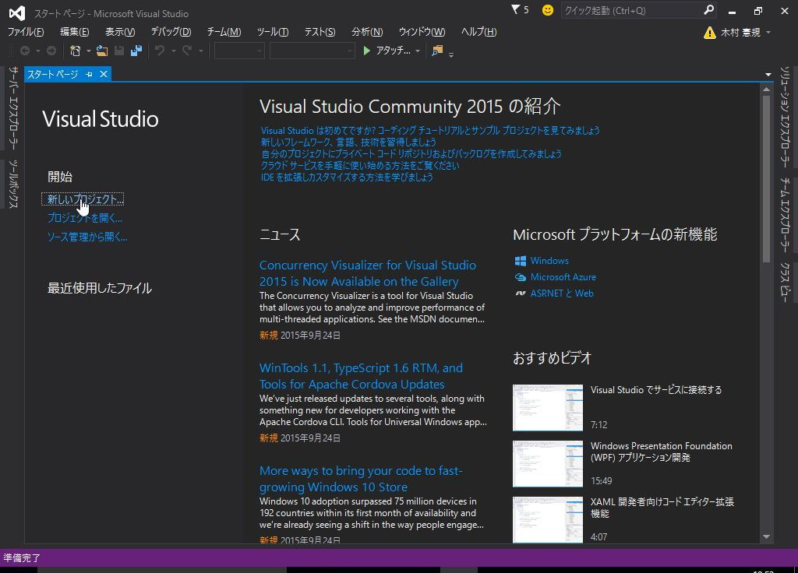

# 2. Windowsフォームアプリケーションの開発 - 1

## Windowsフォームアプリケーションの基礎

単純にクリック回数をカウントするアプリの作成を通して、
Visual Studio の基本的な 操作方法について解説します。

<br><br>

### プロジェクトの作成



*Windowsフォームアプリケーション* を選択します。


名前は *HelloWorld* とします。

<br><br>

### コントロールの配置と設定

*ツール ボックス* から *Button* と *Label* をドラッグしてフォームに配置します。


配置したボタンを選択した状態で、 *プロパティ* を表示します。  
*Text* を *OK* に変更します。


<br><br>

### イベントの割り当て

フォームを読み込んだ際の初期化処理のイベントを割り当てます。

フォームを選択した状態で、 *プロパティ* を表示します。

雷のアイコンをクリックしてイベントを表示し、 *Load* にフォーカスを合わせて
ダブルクリックするか、Enterを押します。


同じように、ボタンをクリックした際のイベントを割り当てます。

ボタンを選択した状態で、*プロパティ* を表示し
*Click* にフォーカスを合わせてダブルクリックします。

<br><br>

### 処理の実装

イベント割り当てを行った時に `Form1.cs` が表示されていると思います。

まだ表示されていない場合は、フォームを右クリックして *コードの表示* を選択します。

```cs
using System;
using System.Windows.Forms;

namespace HelloWorld
{
    public partial class Form1 : Form
    {
        /// <summary>
        /// ボタンのクリック回数
        /// </summary>
        int count;

        public Form1()
        {
            InitializeComponent();
        }

        /// <summary>
        /// 初期化処理
        /// </summary>
        /// <param name="sender"></param>
        /// <param name="e"></param>
        private void Form1_Load(object sender, EventArgs e)
        {
            this.count = 0;
            this.UpdateLabel();
        }

        /// <summary>
        /// ボタンのクリック回数を集計
        /// </summary>
        /// <param name="sender"></param>
        /// <param name="e"></param>
        private void button1_Click(object sender, EventArgs e)
        {
            this.count++;
            this.UpdateLabel();
        }

        /// <summary>
        /// ラベルにクリック回数をセットする
        /// </summary>
        private void UpdateLabel()
        {
            this.label1.Text = string.Format("{0}回 クリックしました。", this.count);
        }
    }
}

```

`Form1` のプロパティとして、ボタンのクリック回数を保持するための `count` 変数を定義しています。

`Form1_Load` はフォームが読み込まれる際に実行されるメソッドです。
そこで `count` 変数の初期化と ラベルの表示内容の設定を行っています。

`button1_Click` はボタンのクリック時に実行されるメソッドです。
クリックされる度に `count` をインクリメントし、ラベルの表示内容を更新しています。

<br><br>

### デバッグ実行

開始ボタンをクリックするか、F5キーを押してデバッグ実行してみてください。


<br><br>

------

<br>

非常に簡単なWindowsフォーム アプリケーションの作り方について解説しました。


[次へ](./classic-003.html)

<br>
