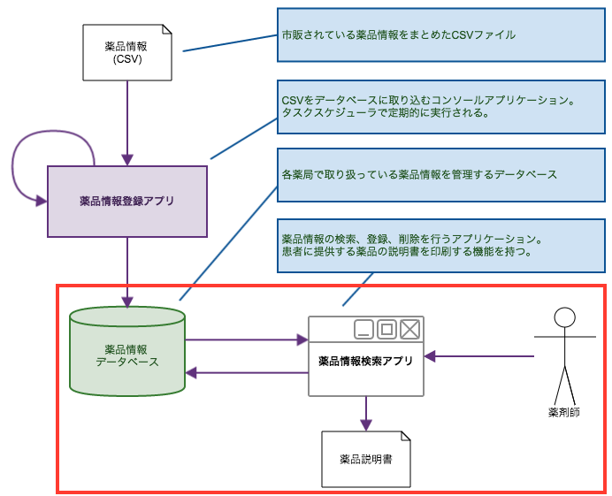

# 2. Windowsフォームアプリケーションの開発 - 2

## アプリケーション仕様

薬品情報の検索及び、薬品情報の登録・編集ができるアプリケーションを開発します。



最終的な画面イメージは以下のようになります。


以降の手順では、[前回](./classic-001.html) のアプリでCSVの内容がローカルのデータベースに登録されている前提で進めていきます。

テーブルが無いと開発が進められませんので、少なくとも前回の内容の「SQL Server にデータベースを作成する」までは実施しておいてください。

<br><br>

## Windowsフォームアプリケーション プロジェクトの作成

新しいプロジェクトを作成します。

名前は *DrugInfoViewer* とします。


<br><br>

### Entity Frameworkのインストール

*NuGet* を使用して、*EntityFramework* をインストールします。

*ソリューション エクスプローラー* で プロジェクト名を右クリックし、*NuGetパッケージの管理* をクリックします。

*EntityFramework* を検索し、*インストール* をクリックします。


ライセンスの確認、変更の確認ウインドウが表示された場合は *OK* をクリックしてインストールを進めてください。

<br><br>

### EDMの作成

[前回](./classic-001.html) と同様、 *データベース・ファースト* で開発していきます。

(1) *ソリューション エクスプローラー* をクリックします。

(2) プロジェクト名を右クリックし、*追加* -> *新しい項目* をクリックします。

(3) *データ* から *ADO.NET Entity Data Model* を選択し、名前を `DrugInfoModel` とします。


<br>

(4) *データベースから EF Designer* を選択し、 *次へ* をクリックします。


<br>

(5) 作成したサーバーが選択されていることを確認します。

(6) *接続設定に名前を付けて App.Config に保存* にチェックをし、 `DrugInfoContext` と入力して *次へ* をクリックします。


<br>

(7) バージョンの選択ウィンドウが表示される場合は、 *Entity Framework 6.x* を選択して *次へ* をクリックします。


<br>

(8) *テーブル* にチェックを入れて *完了* をクリックします。


<br>

(9) *セキュリティ警告* が表示される場合は、 *今後このメッセージを表示しない* にチェックし、 *OK* をクリックします。


<br>

(10) edmxファイルが生成され、デザイナーに取り込まれたテーブルの情報が表示されます。

<br><br>

## 検索処理の実装

### コントロールの配置

検索エリアとグリッドの表示エリアを分けるため、*Split Container* を使用します。

(1) *Split Container* を上下分割に変更します。


<br>

(2) 上部分のパネルのサイズが変わらないように、プロパティで `FixedPanel` = `Panel1` とします。

(3) 上部分のパネルに検索に使用するコンボボックスとボタンを配置します。

(4) コンボボックスのプロパティで、`DropDownStyle` = `DropDownList` とします。


<br>

(5) ボタンのプロパティで、`Text` に `検索` と入力します。


<br><br>

### コンボボックスへのデータバインド

薬効分類ごとの薬品を一覧表示するために、コンボボックスに薬効分類をセットします。

最も少ないコードで実現するには、以下のようにします。

```cs
using System;
using System.Collections.Generic;
using System.ComponentModel;
using System.Data;
using System.Drawing;
using System.Linq;
using System.Text;
using System.Threading.Tasks;
using System.Windows.Forms;

namespace WindowsFormsApplication1
{
    public partial class Form1 : Form
    {
        public Form1()
        {
            InitializeComponent();
        }

        /// <summary>
        /// フォームの初期化
        /// </summary>
        /// <param name="sender"></param>
        /// <param name="e"></param>
        private void Form1_Load(object sender, EventArgs e)
        {
            // コンボボックスに薬効分類をセット
            using (var db = new DrugInfoContext())
            {
                // 薬効分類のリスト
                var list = db.Classifications.ToList();
                this.comboBox1.DisplayMember = "Name";
                this.comboBox1.ValueMember = "ClassificationId";

                this.comboBox1.DataSource = list;
            }
        }
    }
}
```

<br>


<br>

非常に簡単に *Classifications* テーブルの内容をコンボボックスにセットできますが、
コンボボックスの表示を *"分類コード:名称"* に変更する、といったことができません。

その場合は、データ引き渡し用のクラスを用意します。  
このようなクラスのことを *Data Transfer Object* と呼びます。

*ClassificationDTO* というクラスを追加します。

<br>

`ClassificationDTO.cs`

```cs
namespace WindowsFormsApplication1
{
    class ClassificationDTO
    {
        /// <summary>
        /// ClassificationId
        /// </summary>
        public int Id { get; set; }
        /// <summary>
        /// 薬効分類コード
        /// </summary>
        public string Code { get; set; }
        /// <summary>
        /// 名称
        /// </summary>
        public string Name { get; set; }
        /// <summary>
        /// コンボボックスの表示内容
        /// </summary>
        public string Title
        {
            get
            {
                if (string.IsNullOrEmpty(Name))
                {
                    return string.Empty;
                }
                else
                {
                    return string.Format("{0}:{1}", Code, Name);
                }
            }
        }
    }
}
```

<br>

コードと名前をコロンで結合した文字列をコンボボックスのラベルに表示させます。

続いてコンボボックスにデータをセットするよう実装します。

<br>

```cs
using System;
using System.Collections.Generic;
using System.ComponentModel;
using System.Data;
using System.Drawing;
using System.Linq;
using System.Text;
using System.Threading.Tasks;
using System.Windows.Forms;

namespace WindowsFormsApplication1
{
    public partial class Form1 : Form
    {
        public Form1()
        {
            InitializeComponent();
        }

        /// <summary>
        /// フォームの初期化
        /// </summary>
        /// <param name="sender"></param>
        /// <param name="e"></param>
        private void Form1_Load(object sender, EventArgs e)
        {
            // コンボボックスに薬効分類をセット
            using (var db = new DrugInfoContext())
            {
                // 薬効分類のリスト
                var list = db.Classifications
                    .Select(item => new ClassificationDTO {
                        Id = item.ClassificationId,
                        Code = item.ClassificationCode,
                        Name = item.Name
                    })
                    .ToList();

                // 先頭にブランクを登録
                list.Insert(0, new ClassificationDTO {
                    Id = 0,
                    Code = string.Empty,
                    Name = string.Empty
                });

                this.comboBox1.DisplayMember = "Title";
                this.comboBox1.ValueMember = "Id";
                this.comboBox1.DataSource = list;
            }
        }
    }
}
```

DTOクラスにデータを格納し、リストにします。

先頭にブランクを登録し、コンボボックスと紐付けます。

<br><br>

### 動作確認


* 先頭がブランクとなっていることを確認します。
* 2つ目以降、「コード:名称」となっていることを確認します。

<br><br>

## DataGridView へのデータバインド

(1) 下のパネルに *DataGridView* を配置し、親パネルいっぱいに広がるよう設定します。


<br>

(2) *DataGridView* でのデータ編集ができないように、すべてのチェックを外します。


<br>

(3) *DataGridView* に表示するデータを格納するDTOクラスを作成します。

`DrugDTO.cs`

```cs
using System.ComponentModel;

namespace WindowsFormsApplication1
{
    class DrugDTO
    {
        public int Id { get; set; }
        /// <summary>
        /// 薬品コード
        /// </summary>
        [DisplayName("薬品コード")]
        public string Code { get; set; }
        /// <summary>
        /// 薬品名
        /// </summary>
        [DisplayName("薬品名")]
        public string Name { get; set; }
        /// <summary>
        /// 薬効分類コード
        /// </summary>
        [DisplayName("分類コード")]
        public string ClassificationCode { get; set; }
        /// <summary>
        /// 薬効分類名
        /// </summary>
        [DisplayName("分類名")]
        public string ClassificationName { get; set; }
    }
}
```

<br>

### 用語解説: 属性

`[DisplayName("薬品コード")]` など、プロパティの上に記述されたカギカッコで括られた記述は
[属性(Attributes あるいは Annotation)](https://msdn.microsoft.com/ja-jp/library/z0w1kczw.aspx)と呼ばれるものです。

DataGridView で項目が表示される時に、`DisplayName`に設定した文言が項目名として使用されます。

* 参考: [System.ComponentModel.DataAnnotations 名前空間](https://msdn.microsoft.com/ja-jp/library/system.componentmodel.dataannotations.aspx)

<br><br>

### 検索処理の実装

検索ボタンをクリックした際の処理を実装します。

```cs
/// <summary>
/// 検索ボタンのクリックでDataGridViewにデータを表示する
/// </summary>
/// <param name="sender"></param>
/// <param name="e"></param>
private void button1_Click(object sender, EventArgs e)
{
    // コンボボックスの選択内容
    int id = (int)this.comboBox1.SelectedValue;

    using (var db = new DrugInfoContext())
    {
        // 薬品情報の取得
        var list = db.Drugs
            .Where(item => item.ClassificationId == id)
            .Select(item => new DrugDTO
            {
                Id = item.DrugId,
                Code = item.DrugCode,
                Name = item.Name,
                ClassificationCode = item.Classifications.ClassificationCode,
                ClassificationName = item.Classifications.Name
            })
            .ToList();
        // DataGridViewに紐づける
        this.dataGridView1.DataSource = list;
    }
}
```

<br><br>

### 動作確認


* 選択した薬効分類に該当する薬品が *DataGridView* に表示されることを確認します。


<br><br>

### 薬品名による検索処理の実装

(1) 薬品名を入力するテキストボックスを追加します。


追加ボタンは後で使用しますので、ボタンの配置と `Text` の設定だけ行います。

<br>

(2) 検索処理を以下のように修正します。

```cs
/// <summary>
/// 検索ボタンのクリックでDataGridViewにデータを表示する
/// </summary>
/// <param name="sender"></param>
/// <param name="e"></param>
private void button1_Click(object sender, EventArgs e)
{
    // コンボボックスの選択内容
    int id = (int)this.comboBox1.SelectedValue;

    using (var db = new DrugInfoContext())
    {
        // 薬品情報の取得
        var list = db.Drugs
            .Where(item => (id == 0 || item.ClassificationId == id) &&
              (string.IsNullOrEmpty(this.textBox1.Text) || item.Name.Contains(this.textBox1.Text)))
            .Select(item => new DrugDTO
            {
                Id = item.DrugId,
                Code = item.DrugCode,
                Name = item.Name,
                ClassificationCode = item.Classifications.ClassificationCode,
                ClassificationName = item.Classifications.Name
            })
            .ToList();
        // DataGridViewに紐づける
        this.dataGridView1.DataSource = list;
    }
}
```

<br>

薬品名を入力して、検索結果が変わることを確認してください。


<br><br>

## 更新処理の実装

### フォームの追加

(1) *ソリューション エクスプローラー* をクリックします。

(2) プロジェクト名を右クリックし、*追加* -> *Windowsフォーム* をクリックします。


<br>

(3) デフォルトの名前のまま、*追加* をクリックします。

(4) 以下のようにコントロールを配置します。(赤字は各コントロールの `Name` です)


<br>

(5) フォームのプロパティを以下のように設定します。

* `ControlBox` = `False` : タイトルバーの「最小化」、「最大化」、「閉じる」といったボタンが非表示となります
* `FormBorderStyle` = `FixedDialog` : フォームのサイズ変更ができなくなります
* `Text` = `薬品情報` : フォームのタイトルです

<br>

(6) 親画面から表示する薬品のIDを受け渡しできるように 変数 `DrugId` を追加します。

```cs
using System.Windows.Forms;

namespace WindowsFormsApplication1
{
    public partial class Form2 : Form
    {
        /// <summary>
        /// 薬品ID
        /// </summary>
        public int DrugId = 0;

        public Form2()
        {
            InitializeComponent();
        }
    }
}
```

<br>

(7) キャンセルボタンをクリックされた際に自分自身を閉じます。

```cs
/// <summary>
/// キャンセルボタンクリックでフォームを閉じる
/// </summary>
/// <param name="sender"></param>
/// <param name="e"></param>
private void btnCancel_Click(object sender, EventArgs e)
{
    this.Close();
}
```

<br><br>

### フォームの表示

(1) 親画面から子フォームをモーダル表示する処理を実装します。  

```cs
using System;
using System.Data;
using System.Linq;
using System.Windows.Forms;

namespace WindowsFormsApplication1
{
    public partial class Form1 : Form
    {
        /// <summary>
        /// 子画面
        /// </summary>
        private Form2 subForm;

/* ~~ 省略 ~~ */

        /// <summary>
        /// 子画面を表示する
        /// </summary>
        /// <param name="drugId"></param>
        private void ShowSubForm(int drugId)
        {
            if (subForm == null)
            {
                subForm = new Form2();
            }
            // 薬品IDをセットする
            subForm.DrugId = drugId;
            // モーダル表示する
            subForm.ShowDialog(this);
        }
    }
}
```

(2) 「追加」ボタンのクリックと *DataGridView* で行をダブルクリックした場合にフォームを開きます。

```cs
/// <summary>
/// 追加ボタンのクリックで子画面を表示する
/// </summary>
/// <param name="sender"></param>
/// <param name="e"></param>
private void button2_Click(object sender, EventArgs e)
{
    // 子画面を表示 (追加時の薬品IDは0固定とする)
    this.ShowSubForm(0);
}

/// <summary>
/// セルのダブルクリックで子画面を表示する
/// </summary>
/// <param name="sender"></param>
/// <param name="e"></param>
private void dataGridView1_CellDoubleClick(object sender, DataGridViewCellEventArgs e)
{
    // 選択された薬品のIDを取得
    int id = (int)this.dataGridView1.Rows[e.RowIndex].Cells["Id"].Value;
    // 子画面を表示
    this.ShowSubForm(id);
}
```

<br>

### 動作確認

* ボタンクリック、行のダブルクリックでフォームが表示されることを確認します。
* フォームがモーダルダイアログとして表示されることを確認します。
* キャンセルボタンでフォームが閉じ、親画面に戻ることを確認します。

<br><br>

### フォームの初期化処理

(1) コンボボックスに薬効分類をセットする処理を実装します。

```cs
/// <summary>
/// 薬効分類をコンボボックスにセットする
/// </summary>
private void BindClassifications()
{
    using (var db = new DrugInfoContext())
    {
        // 薬効分類のリストを取得
        var list = db.Classifications.Select(item => new ClassificationDTO
        {
            Id = item.ClassificationId,
            Code = item.ClassificationCode,
            Name = item.Name
        }).ToList();

        // 先頭にブランクをセット
        list.Insert(0, new ClassificationDTO
        {
            Id = 0,
            Code = string.Empty,
            Name = string.Empty
        });

        // コンボボックスの表示設定
        this.cmbClass.DisplayMember = "Title";
        this.cmbClass.ValueMember = "Id";
        this.cmbClass.DataSource = list;
    }
}
```

<br>

(2) 親画面から引き渡された薬品IDを元に、薬品情報を取得してフォームに表示します。

```cs
/// <summary>
/// 薬品情報をフォームに表示する
/// </summary>
private void SetDrug()
{
    using (var db = new DrugInfoContext())
    {
        var drug = db.Drugs
            .Where(item => item.DrugId == this.DrugId)
            .FirstOrDefault();

        if (drug != null)
        {
            this.lblId.Text = this.DrugId.ToString();
            this.lblCode.Text = drug.DrugCode;
            this.txtName.Text = drug.Name;
            this.txtCompany.Text = drug.Company;
            this.cmbClass.SelectedValue = drug.ClassificationId;
        }
    }
}
```

<br>

(3) CSVから登録されたデータについては更新・削除できないようにボタンを無効化します。

<br>

(4) 薬品の追加時は削除ボタンを無効化します。

```cs
/// <summary>
/// フォームの初期化処理
/// </summary>
/// <param name="sender"></param>
/// <param name="e"></param>
private void Form2_Load(object sender, EventArgs e)
{
    // ラベルの初期化
    this.lblId.Text = string.Empty;
    this.lblCode.Text = string.Empty;

    // コンボボックスの表示
    this.BindClassifications();

    if (this.DrugId != 0)
    {
        // 薬品情報の表示・更新
        this.SetDrug();
        // 更新・削除ボタンの制御
        if (string.IsNullOrEmpty(this.lblCode.Text))
        {
            // 薬品コードがブランクの場合は更新・削除可能
            this.btnAdd.Enabled = true;
            this.btnDel.Enabled = true;
        }
        else
        {
            // 薬品コードが存在する場合は更新・削除不可
            this.btnAdd.Enabled = false;
            this.btnDel.Enabled = false;
        }
    }
    else
    {
        // 薬品情報の追加
        this.btnAdd.Enabled = true;
        this.btnDel.Enabled = false;
    }
}
```

<br><br>

### Entity Frameworkでのデータ登録・更新

登録ボタンを押された際にデータの登録・更新処理を行います。  
親画面からIDが渡されているかどうかで処理を切り替えます。

(1) 登録ボタンクリック時の処理

```cs
/// <summary>
/// 登録ボタンクリックで追加・更新処理を行う
/// </summary>
/// <param name="sender"></param>
/// <param name="e"></param>
private void btnAdd_Click(object sender, EventArgs e)
{
    bool ret = false;

    // 入力チェック
    if (this.validate())
    {
        if (this.DrugId == 0)
        {
            // 追加
            ret = this.AddDrug();
        }
        else
        {
            // 更新
            ret = this.UpdateDrug();
        }

        if (ret)
        {
            // 登録成功
            MessageBox.Show("登録が完了しました。");
            this.Close();
        }
        else
        {
            // 登録失敗
            MessageBox.Show("登録に失敗しました。");
        }
    }
}
```

`DrugId` が 0 の場合は追加、それ以外は更新処理を行います。

追加・更新が完了したら、成否に応じてメッセージを表示します。  
また、成功時はフォームを閉じて親画面に戻ります。

<br>

(2) 入力チェック

薬品名と薬効分類は必須項目なので、入力チェックにて未入力の場合はエラーとします。

```cs
/// <summary>
/// 入力チェック
/// </summary>
/// <returns></returns>
private bool validate()
{
    string msg = "登録に失敗しました。\n{0}";
    bool valid = true;

    if (string.IsNullOrEmpty(this.txtName.Text))
    {
        // 薬品名は必須
        msg = string.Format(msg, "薬品名は必須項目です。");
    }

    if ((int)this.cmbClass.SelectedValue == 0)
    {
        // 薬効分類は必須
        msg = string.Format(msg, "薬効分類は必須項目です。");
    }

    if (!valid)
    {
        // エラーメッセージを表示する
        MessageBox.Show(msg);
    }

    return valid;
}
```

<br>

(3) 追加時の処理

追加時の処理は以下のようになります。

```cs
/// <summary>
/// 薬品情報の追加処理
/// </summary>
private bool AddDrug()
{
    try {
        using (var db = new DrugInfoContext())
        {
            // フォームの入力値を取得
            var drug = this.GetFormValue();
            // 薬品を追加
            db.Drugs.Add(drug);
            // 更新を保存
            db.SaveChanges();
        }
    }
    catch (Exception e)
    {
        System.Diagnostics.Debug.WriteLine(e.Message);
        return false;
    }

    return true;
}

/// <summary>
/// フォームの入力値を取得する
/// </summary>
/// <returns></returns>
private Drugs GetFormValue()
{
    var drug = new Drugs
    {
        DrugId = this.DrugId,
        DrugCode = this.lblCode.Text,
        Name = this.txtName.Text,
        Company = this.txtCompany.Text,
        ClassificationId = (int)this.cmbClass.SelectedValue
    };

    return drug;
}
```

データベースへの登録時に、何らかのアクシデントで登録に失敗した場合、例外(`Exception`) が発生します。

通常、例外が発生するとアプリケーションが停止しますが、
`try` ステートメントの範囲内では例外が発生した場合は `catch` に処理が移ります。

ファイルやデータベースの読み書きを行う際は、`using` とともに
`try-catch` を使用する事が多いです。

* [try-catch (C# リファレンス)](https://msdn.microsoft.com/ja-jp/library/0yd65esw.aspx)
* [エラー処理（例外処理）の基本](http://dobon.net/vb/dotnet/beginner/exceptionhandling.html)

<br>

(4) 更新時の処理

```cs
/// <summary>
/// 薬品情報の更新処理
/// </summary>
private bool UpdateDrug()
{
    try
    {
        using (var db = new DrugInfoContext())
        {
            // 更新対象の薬品を取得
            var drug1 = db.Drugs
                .Where(item => item.DrugId == this.DrugId)
                .FirstOrDefault();

            if (drug1 == null)
            {
                // 薬品が取得できなかった
                return false;
            }

            // 入力値を取得
            var drug2 = this.GetFormValue();

            // プロパティを更新
            drug1.Name = drug2.Name;
            drug1.Company = drug2.Company;
            drug1.ClassificationId = drug2.ClassificationId;

            // 変更を保存
            db.SaveChanges();
        }
    }
    catch (Exception e)
    {
        System.Diagnostics.Debug.WriteLine(e.Message);
        return false;
    }

    return true;
}
```

<br><br>

### Entity Frameworkでのデータ削除

(1) 削除ボタンクリック時の処理

```cs
/// <summary>
/// 削除ボタンのクリックで、DrugIdに該当する薬品を削除する
/// </summary>
/// <param name="sender"></param>
/// <param name="e"></param>
private void btnDel_Click(object sender, EventArgs e)
{
    if (this.DrugId != 0)
    {
        if (this.DeleteDrug())
        {
            MessageBox.Show("薬品を削除しました。");
            this.Close();
        }
        else
        {
            MessageBox.Show("薬品の削除に失敗しました。");
        }
    }
}

/// <summary>
/// 薬品を削除する
/// </summary>
/// <returns></returns>
private bool DeleteDrug()
{
    try
    {
        using (var db = new DrugInfoContext())
        {
            // 対象の薬品を取得
            var drug = db.Drugs
                .Where(item => item.DrugId == this.DrugId)
                .FirstOrDefault();

            if (drug == null)
            {
                return false;
            }

            // 薬品を削除する
            db.Drugs.Remove(drug);

            db.SaveChanges();
        }
    }
    catch (Exception exp)
    {
        System.Diagnostics.Debug.WriteLine(exp.Message);
        return false;
    }
    return true;
}
```

<br><br>

## 動作確認

追加、更新、削除が正常に動作することを確認します。

<br><br>

------

[次へ](./classic-004.html)

<br><br>
