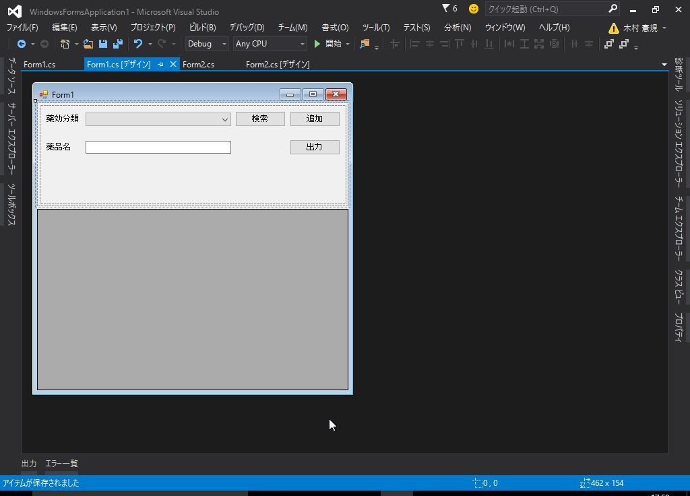
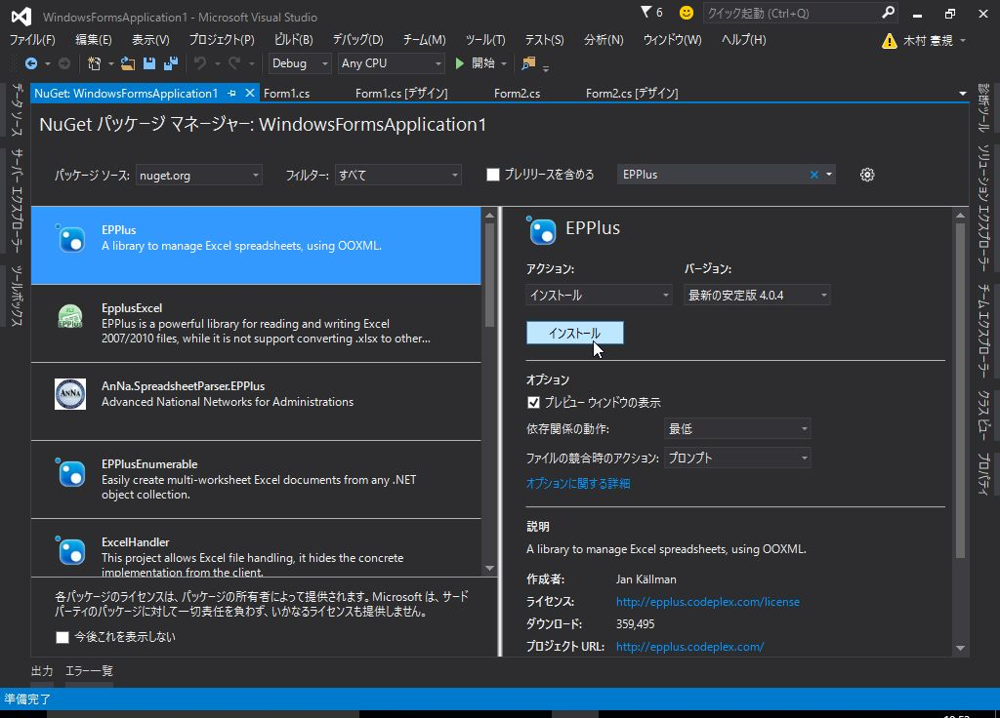
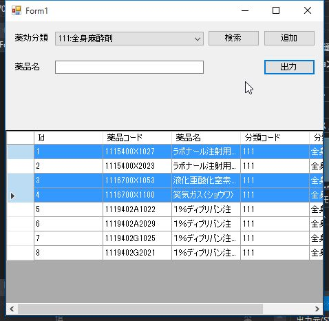

# 2. Windowsフォームアプリケーションの開発 - 3

## 薬品情報の出力処理

選択された行の薬品情報をExcelファイルに出力します。

<br><br>

### フォームの修正

フォームに「出力」ボタンを追加します。



<br><br>

### 選択された薬品の取得

`dataGridView` の選択行を取得するには、`SelectedRows` を使用します。

とりあえず、テストとして以下のように実装してみます。

```cs
/// <summary>
/// 出力ボタンのクリック
/// </summary>
/// <param name="sender"></param>
/// <param name="e"></param>
private void button3_Click(object sender, EventArgs e)
{
    // 選択されている行を取得
    foreach(DataGridViewRow row in dataGridView1.SelectedRows)
    {
        System.Diagnostics.Debug.WriteLine(row.Cells["Id"].Value);
    }
}
```

実際に動かしてみると、`SelectedRows` にはクリックした順に格納されるので `foreach` で順に取り出すとId順になりません。

一旦 List に選択されたIdを格納し Sort した後、
Idに該当する薬品情報をデータベースから取得するよう実装します。

<br>

```cs
/// <summary>
/// 選択されている薬品IDを取得する
/// </summary>
/// <returns></returns>
private List<int> GetSelectedIds()
{
    List<int> list = new List<int>();

    // 選択されている行を取得
    foreach (DataGridViewRow row in dataGridView1.SelectedRows)
    {
        list.Add((int)row.Cells["Id"].Value);
    }

    // 昇順に並び替え
    list.Sort();

    return list;
}

/// <summary>
/// IDのリストをもとに薬品情報を取得する
/// </summary>
/// <param name="selectedIdList"></param>
/// <returns></returns>
private List<List<string>> GetDrugInfo(List<int> selectedIdList)
{
    List<List<string>> data = new List<List<string>>();

    using (var db = new DrugInfoContext())
    {
        foreach (int id in selectedIdList)
        {
            // 薬品情報を取得
            var drug = db.Drugs
                .Where(item => item.DrugId == id)
                .FirstOrDefault();

            if (drug != null)
            {
                // リストに格納
                List<string> row = new List<string>();

                row.Add(drug.Classifications.ClassificationCode); // 薬効分類コード
                row.Add(drug.Classifications.Name); // 薬効分類
                row.Add(drug.DrugCode); // 薬品コード
                row.Add(drug.Name); // 薬品名
                row.Add(drug.Company); // 会社名

                data.Add(row);
            }
        }
    }

    return data;
}
```

<br><br>

### Excelファイルの出力

今回、Excelファイルの出力に [EPPlus](http://epplus.codeplex.com/) を使用します。  
NuGetで *EPPlus* をインストールします。



<br>

*EPPlus* を使用して、Excelファイルを生成します。

```cs
using OfficeOpenXml; // <- 先頭に追加
/* ~~ 中略 ~~ */

/// <summary>
/// Excelファイルを出力する
/// </summary>
/// <param name="data">薬品データ</param>
/// <param name="fileName">ファイル名</param>
/// <returns>ファイルパス</returns>
private string OutputExcel(List<List<string>> data, string fileName)
{
    // 出力ファイル
    var file = new System.IO.FileInfo(fileName);
    // すでにファイルが存在する場合は削除
    if (file.Exists)
    {
        file.Delete();
    }

    // Excelファイルの作成
    using (var excel = new ExcelPackage(file))
    {
        // シート追加
        var sheet = excel.Workbook.Worksheets.Add("薬品情報");

        int rowIndex = 1; // 行番号
        int colIndex = 1; // 列番号

        foreach (var row in data)
        {
            colIndex = 1;

            foreach (var col in row)
            {
                var cell = sheet.Cells[rowIndex, colIndex];
                cell.Value = col;

                colIndex++;
            }
            rowIndex++;
        }
        // excel保存
        excel.Save();
    }

    return file.FullName;
}
```

* 参考: [FileInfo クラス](https://msdn.microsoft.com/ja-jp/library/system.io.fileinfo.aspx)

<br><br>

### 出力ボタンの実装

*DataGridView* の選択行の取得、データベースからの薬品情報取得、*EPPlus* によるExcelファイル出力を
組み立てて、出力ボタンの処理を実装します。

```cs
/// <summary>
/// 出力ボタンのクリック
/// </summary>
/// <param name="sender"></param>
/// <param name="e"></param>
private void button3_Click(object sender, EventArgs e)
{
    // 選択行の取得
    var list = this.GetSelectedIds();

    if (list.Count == 0)
    {
        // 選択行がなければ終了
        MessageBox.Show("薬品を選択してください。");
        return;
    }

    // データの取得
    var data = this.GetDrugInfo(list);

    // Excel出力
    var filePath = this.OutputExcel(data, "output.xlsx");

    MessageBox.Show(string.Format("Excelファイルを出力しました。\n{0}", filePath));
}
```

<br><br>

### 動作確認



*DataGridView* で適当な行を選択し、「出力」ボタンをクリックしてください。

実行ファイルと同じフォルダに `output.xlsx` というファイルが生成されています。


<br><br>
