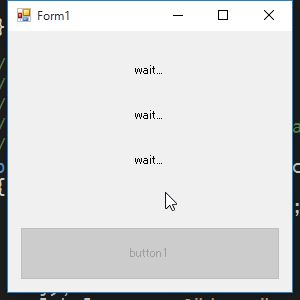

# 3. 非同期処理の基礎

.NET Framework 4.5 から導入された *async/await* キーワードを使用した非同期処理について解説します。

<br><br>

参考: [連載：C# 5.0＆VB 11.0新機能「async／await非同期メソッド」入門](http://www.atmarkit.co.jp/ait/subtop/features/dotnet/app/masterasync_index.html)

非同期処理を行う必要があるシーンには、以下の様なものが挙げられます。

* 重たい処理をするとき
* ファイルの読み書きやネットワーク通信など、不定な待ち時間が発生する処理をするとき

時間がかかる処理が原因で、アプリケーションやUIがフリーズすることを防ぐのが目的となります。

<br><br>

## 最もシンプルな非同期処理の例

重たい処理の変わりに、ボタンをクリックすると3秒待機するという
非常にシンプルなアプリを作成し、非同期処理の基本的な動きについて解説していきます。

<br>

### アプリがフリーズする例

非同期処理を使わずに実装した場合のサンプルです。

```cs
using System;
using System.Threading;
using System.Windows.Forms;

namespace WindowsFormsApplication4
{
    public partial class Form1 : Form
    {
        public Form1()
        {
            InitializeComponent();
        }

        private void button1_Click(object sender, EventArgs e)
        {
            label1.Text = "開始";
            Cals();
            label1.Text = "終了";
        }

        /// <summary>
        /// 重たい計算処理
        /// </summary>
        private void Cals()
        {
            Thread.Sleep(3000);
        }
    }
}
```

ボタンをクリックすると、待機中はアプリがフリーズしてしまいます。

これは、重たい処理とUIの更新処理が同期的に実行されるために発生します。

重たい処理を非同期処理とすることにより、UIの更新処理を阻害しなくなるため
アプリがフリーズすることを回避できます。

* [第1回　.NET開発における非同期処理の基礎と歴史](http://www.atmarkit.co.jp/fdotnet/chushin/masterasync_01/masterasync_01_01.html)
  - 「同期処理」を参照

<br><br>

### 非同期メソッドを使用する

非同期メソッドを使用して、アプリがフリーズしないように修正します。

```cs
using System;
using System.Threading;
using System.Threading.Tasks;
using System.Windows.Forms;

namespace WindowsFormsApplication4
{
    public partial class Form1 : Form
    {
        public Form1()
        {
            InitializeComponent();
        }

        private async void button1_Click(object sender, EventArgs e)
        {
            label1.Text = "開始";
            await Cals();
            label1.Text = "終了";
        }

        /// <summary>
        /// 重たい計算処理
        /// </summary>
        private Task CalsAsync()
        {
            return Task.Run(() => {
                Thread.Sleep(3000);
            });
        }
    }
}
```

ボタンをクリックすると、UIが意図通りに更新され、ドラッグ等の操作も受け付けることを確認します。

<br>

### 用語解説: *Task* クラス

非同期メソッドから呼ばれる処理の戻り値として使用します。

後述する *await* 演算子を付けることの出来るメソッドは *Task* クラスを返すものになります。

また、非同期処理から戻り値を受け取る場合は *Task<T>* クラスを使用します。

<br>

### 用語解説: *async* 修飾子

*async* は、修飾したメソッド内で *await* を利用するためのキーワードです。

*async* を付けたメソッドを *非同期メソッド* と呼びます。

しかしながら、このメソッドのそものが非同期で実行されるわけではなく、
「このメソッドに非同期処理を待つ必要がある処理(await)がある」ということを意味しています。

非同期メソッドの末尾に "Async" と付けることで、他のメソッドと区別するようにします。

<br>

### 用語解説: *await* 演算子

*await* に *Task* クラスを渡すことにより、非同期処理の実行が可能です。

待っているタスクがまだ完了していない場合、メソッドの残りをそのタスクの『継続』として登録して
呼び出し元に処理を戻し、タスクが完了したら登録しておいた継続処理を実行します。

<br><br>

## 非同期処理から戻り値を受け取る

```cs
using System;
using System.Threading;
using System.Threading.Tasks;
using System.Windows.Forms;

namespace WindowsFormsApplication3
{
    public partial class Form1 : Form
    {
        public Form1()
        {
            InitializeComponent();
        }

        private async void button1_Click(object sender, EventArgs e)
        {
            label1.Text = "計算中";
            var result = await CalcAsync(1, 1);
            label1.Text = result.ToString();
        }

        private Task<int> CalcAsync(int x, int y)
        {
            var task = Task.Run(() =>
            {
                Thread.Sleep(3000);
                return x + y;
            });
            return task;
        }
    }
}
```

`Task<int>` といったように、非同期処理で戻り値となる型を指定することで
非同期処理の計算結果を取得することができます。

非同期で呼ばれる処理 (`Task.Run` から呼ばれる処理) は特別な指定はなく、そのまま `return` します。


* 参考: [第2回　非同期メソッドの構文](http://www.atmarkit.co.jp/fdotnet/chushin/masterasync_02/masterasync_02_02.html)
  - 「戻り値」を参照

<br><br>

## 複数の非同期処理を実行する

複数の非同期処理が存在する場合について、詳しく見ていきます。

<br>

### 直列に実行

複数の非同期処理を順に実行するサンプルです。

```cs
using System;
using System.Threading;
using System.Threading.Tasks;
using System.Windows.Forms;

namespace WindowsFormsApplication2
{
    public partial class Form1 : Form
    {
        public Form1()
        {
            InitializeComponent();
        }

        /// <summary>
        /// 重たい処理
        /// </summary>
        /// <param name="label"></param>
        /// <returns></returns>
        private async Task CalcAsync(Label label)
        {
            label.Text = @"wait...";
            await Task.Run(() =>
            {
                Thread.Sleep(3000);
            });
            label.Text = @"done.";
        }

        /// <summary>
        /// UIがフリーズしない書き方
        /// </summary>
        /// <param name="sender"></param>
        /// <param name="e"></param>
        private async void button1_Click(object sender, EventArgs e)
        {
            this.button1.Enabled = false;

            await CalcAsync(this.label1);
            await CalcAsync(this.label2);
            await CalcAsync(this.label3);

            this.button1.Enabled = true;
        }
    }
}
```



ボタンをクリックすると、ラベルが上から順に更新されることを確認します。

ある非同期処理の結果を受けて、別の非同期処理にその結果を引き渡すような場合は、非同期処理を順に実行する必要があります。


<br><br>

### 並列に実行する

重たい処理を並列に実行することで、処理時間の短縮を図ることができます。

```cs
using System;
using System.Threading;
using System.Threading.Tasks;
using System.Windows.Forms;

namespace WindowsFormsApplication1
{
    public partial class Form1 : Form
    {
        public Form1()
        {
            InitializeComponent();
        }

        /// <summary>
        /// 重たい処理
        /// </summary>
        /// <param name="label"></param>
        /// <returns></returns>
        private async Task CalcAsync(Label label)
        {
            label.Text = @"wait...";
            await Task.Run(() =>
            {
                Thread.Sleep(3000);
            });
            label.Text = @"done.";
        }

        /// <summary>
        /// フリーズしない処理
        /// </summary>
        /// <param name="sender"></param>
        /// <param name="e"></param>
        private async void button1_Click(object sender, EventArgs e)
        {
            this.button1.Enabled = false;

            var t1 = CalcAsync(this.label1);
            var t2 = CalcAsync(this.label2);
            var t3 = CalcAsync(this.label3);

            // すべて完了するまで待機
            await Task.WhenAll(t1, t2, t3);

            this.button1.Enabled = true;
        }
    }
}
```

`await Task.WhenAll(t1, t2, t3);` で各タスクが完了するまで待機しています。

ボタンをクリックすると、ほぼ同時にラベルが "wait..." となり、すべてのラベルが "done" になると
ボタンがクリックできるようになります。

ファイルのダウンロードなど、同時に実行しても他の非同期処理に影響を及ぼさないものは
並列に実行することで、全体の処理時間を短縮することができます。

しかしながら、DBアクセスやファイルの読み書きなど、排他制御が必要となるような場合は
処理が複雑になりますし、デバッグも難しいので、注意が必要です。


* 参考: [第2回　非同期メソッドの構文](http://www.atmarkit.co.jp/fdotnet/chushin/masterasync_02/masterasync_02_01.html)
  - 「非同期メソッドの動き」を参照

<br><br>

-----------
