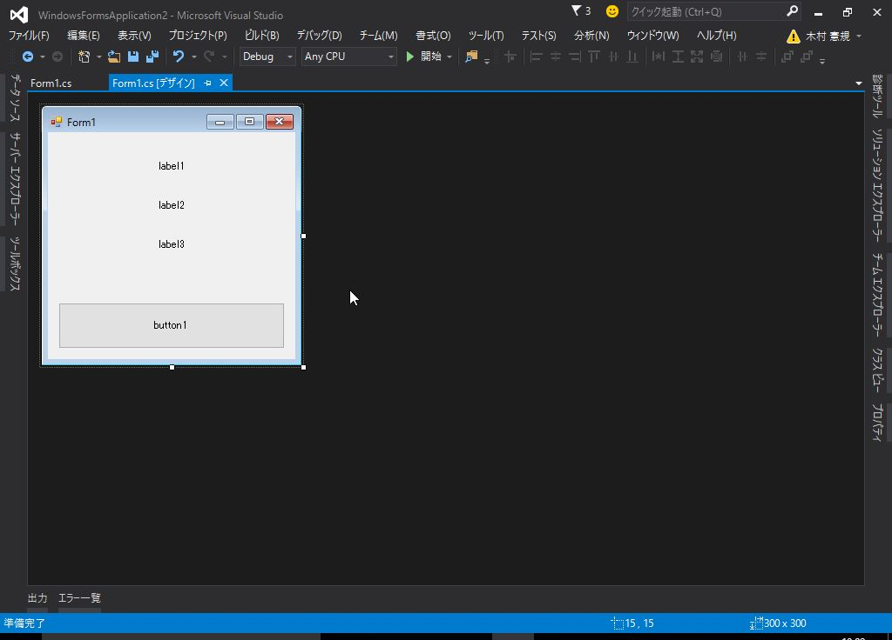
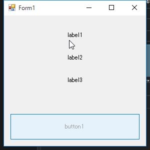

# 3. 非同期処理の基礎 - (1)

.NET Framework 4.5 から導入された *async/await* キーワードを使用した非同期処理について解説します。

<br><br>

参考: [連載：C# 5.0＆VB 11.0新機能「async／await非同期メソッド」入門](http://www.atmarkit.co.jp/ait/subtop/features/dotnet/app/masterasync_index.html)

非同期処理を行う必要があるシーンには、以下の様なものが挙げられます。

* 重たい処理をするとき
* ファイルの読み書きやネットワーク通信など、不定な待ち時間が発生する処理をするとき

時間がかかる処理が原因で、アプリケーションやUIがフリーズすることを防ぐのが目的となります。

<br><br>

### アプリがフリーズする例

重たい処理の変わりに、ボタンをクリックすると3秒待機するアプリを作成します。



```cs
using System;
using System.Threading;
using System.Windows.Forms;

namespace WindowsFormsApplication2
{
    public partial class Form1 : Form
    {
        public Form1()
        {
            InitializeComponent();
        }

        /// <summary>
        /// 重たい処理
        /// </summary>
        /// <param name="label"></param>
        private void Calc(Label label)
        {
            label.Text = "wait...";
            Thread.Sleep(3000); // 3秒待機
            label.Text = "done.";
        }

        /// <summary>
        /// UIがフリーズしてしまう処理
        /// </summary>
        /// <param name="sender"></param>
        /// <param name="e"></param>
        private void button1_Click(object sender, EventArgs e)
        {
            this.button1.Enabled = false;

            Calc(this.label1);
            Calc(this.label2);
            Calc(this.label3);

            this.button1.Enabled = true;
        }
    }
}
```

ボタンをクリックして、UIが固まることを確認します。



これは、重たい処理とUIの更新処理が同期的に実行されるために発生します。

重たい処理を非同期処理とすることにより、UIの更新処理を阻害しなくなるため
アプリがフリーズすることを回避できます。

* [第1回　.NET開発における非同期処理の基礎と歴史](http://www.atmarkit.co.jp/fdotnet/chushin/masterasync_01/masterasync_01_01.html)
  - 「同期処理」を参照

<br><br>

### 重たい処理の非同期化

*async/await* で非同期メソッドの機能を使用して処理を非同期化します。

```cs
using System;
using System.Threading;
using System.Threading.Tasks;
using System.Windows.Forms;

namespace WindowsFormsApplication1
{
    public partial class Form1 : Form
    {
        public Form1()
        {
            InitializeComponent();
        }

        /// <summary>
        /// 重たい処理
        /// </summary>
        /// <param name="label"></param>
        /// <returns></returns>
        private async Task CalcAsync(Label label)
        {
            label.Text = @"wait...";
            await Task.Run(() =>
            {
                Thread.Sleep(3000);
            });
            label.Text = @"done.";
        }

        /// <summary>
        /// フリーズしない処理
        /// </summary>
        /// <param name="sender"></param>
        /// <param name="e"></param>
        private async void button1_Click(object sender, EventArgs e)
        {
            this.button1.Enabled = false;

            var t1 = CalcAsync(this.label1);
            var t2 = CalcAsync(this.label2);
            var t3 = CalcAsync(this.label3);

            // すべて完了するまで待機
            await Task.WhenAll(t1, t2, t3);

            this.button1.Enabled = true;
        }
    }
}
```


ボタンをクリックすると、UIが意図通りに更新され、ドラッグ等の操作も受け付けることを確認します。

<br>

### *async* 修飾子

*async* は、修飾したメソッド内で *await* を利用するためのキーワードです。

*async* を付けたメソッドを *非同期メソッド* と呼びます。

しかしながら、このメソッドのそものが非同期で実行されるわけではなく、
「このメソッドに非同期処理を待つ必要がある処理(await)がある」ということを意味しています。

非同期メソッドの末尾に "Async" と付けることで、他のメソッドと区別するようにします。

<br>

### *await* 演算子

*await* に *Task* クラスを渡すことにより、非同期処理の実行が可能です。

待っているタスクがまだ完了していない場合、メソッドの残りをそのタスクの『継続』として登録して
呼び出し元に処理を戻し、タスクが完了したら登録しておいた継続処理を実行します。

* 参考: [第2回　非同期メソッドの構文](http://www.atmarkit.co.jp/fdotnet/chushin/masterasync_02/masterasync_02_01.html)
  - 「非同期メソッドの動き」を参照

<br><br>

----------

[次へ](classic-302.html)
