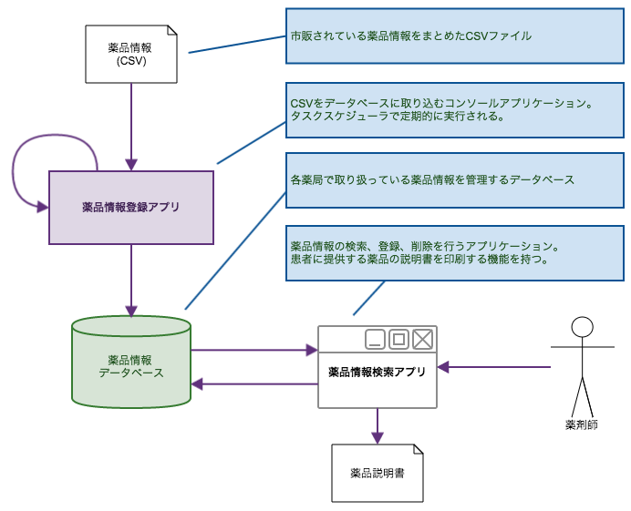
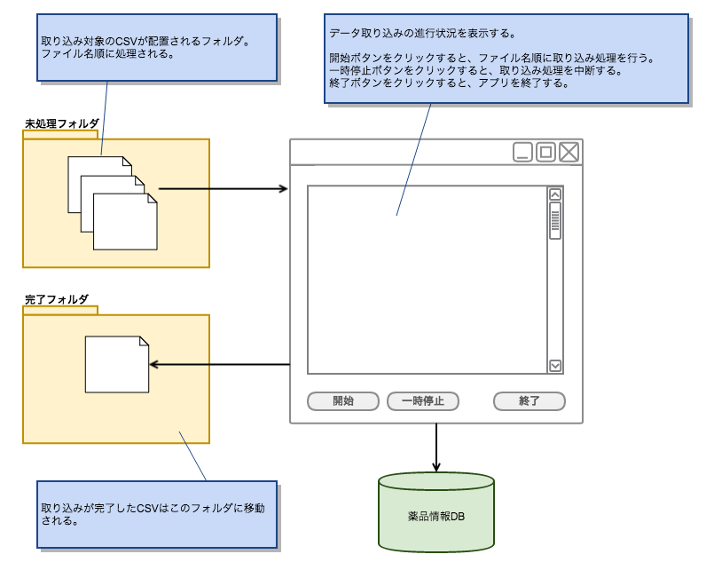

# .NET Framework アプリケーション開発入門

.NET Frameworkを使用したクライアント アプリケーションの開発方法について解説します。

 

## サンプル・アプリケーションのイメージ図

薬局内のPCにインストールされる「薬品情報管理システム」を題材とします。

 

各薬局には一般に流通している薬品情報がCSV形式で定期的 (1日1回) に配信されるものとします。

薬局内のPCでは、「薬品情報登録アプリ」が定期的に実行され、
配信されたCSVをそのPC内で稼働しているSQL Serverの特定テーブルに取り込みます。

 

薬剤師は「薬品情報検索アプリ」を使用して、取り込まれたデータを検索します。

CSVに登録されていないがその薬局で取り扱っている薬品情報は、薬剤師が「薬品情報検索アプリ」を使用して登録します。
また、登録したデータは変更、削除が可能です。
(CSVから登録された薬品は編集不可とします)

 

「薬品情報検索アプリ」は、薬局に来られたお客様にお渡しする「薬品説明書」を印刷する機能を持つものとします。

 

------

 
 

## [1. 簡単なコンソールアプリケーションの開発](./classic-001.html)

GUIのないコンソールアプリケーションの作成を通して、Entity Frameworkを使用した
データベースへのデータ登録、参照、更新、削除の操作について解説します。

 

* 参考
  - [Entity Framework](https://msdn.microsoft.com/ja-jp/data/ef)
  - [Data Developer Center > Learn > Entity Framework > Get Started > Database First](https://msdn.microsoft.com/en-us/data/jj206878)
  - [連載:ADO.NET Entity Framework入門](http://www.atmarkit.co.jp/fdotnet/ef4basic/index/index.html)

 
 

------
 

## [2. Windowsフォームアプリケーションの開発](./classic-002.html)

SQL Serverの検索、登録、更新、削除を行うアプリケーションを作成します。

* 参考
  - [連載：Windowsフォーム開発入門【Visual Studio 2010対応】](http://www.atmarkit.co.jp/fdotnet/chushin/introwinform_index/index.html)
  - [EPPlus](http://epplus.codeplex.com/)
  - [EPPlusの基本的な使い方メモ (xlsx形式, Excelのインストール必要ない, COM使わない)](http://devlights.hatenablog.com/entry/2015/04/02/062545)
  - [方法: プログラムによって文書を印刷する](https://msdn.microsoft.com/ja-jp/library/b9f0ke7y.aspx)
  - [EXCEL印刷(Worksheet.PrintOut)のサンプル(C#.NET)](http://homepage2.nifty.com/nonnon/SoftSample/CS.NET/SampleExcelPrint.html)

 
 

* Windowsフォームアプリケーション プロジェクトの作成
  - Entity Frameworkのインストール
  - EDMの作成
* Windowsフォームの基本
* 検索処理の実装
  - イベント処理の実装
  - LINQによるデータ操作
* 更新処理の実装
  - フォームの追加
  - Entity Frameworkでのデータ更新、削除
* Officeファイルの操作
  - EPPlusによるExcelファイルの作成
  - Excelファイルの更新
* 動作確認

 
 

-------

 

## 3. 非同期処理の基礎

.NET Framework 4.5 から導入された *async/await* キーワードを使用した非同期処理について解説します。

参考: [連載：C# 5.0＆VB 11.0新機能「async／await非同期メソッド」入門](http://www.atmarkit.co.jp/ait/subtop/features/dotnet/app/masterasync_index.html)

 

## 4. 非同期処理を組み込んだアプリケーションの開発

 

CSV取り込み時に進捗状況を表示するインターフェースを用意します。

取り込み処理中もアプリケーションが固まらないように、CSV読み込み・データ登録処理をバックグラウンドのスレッドで実行します。

  
