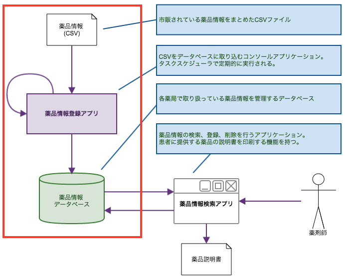
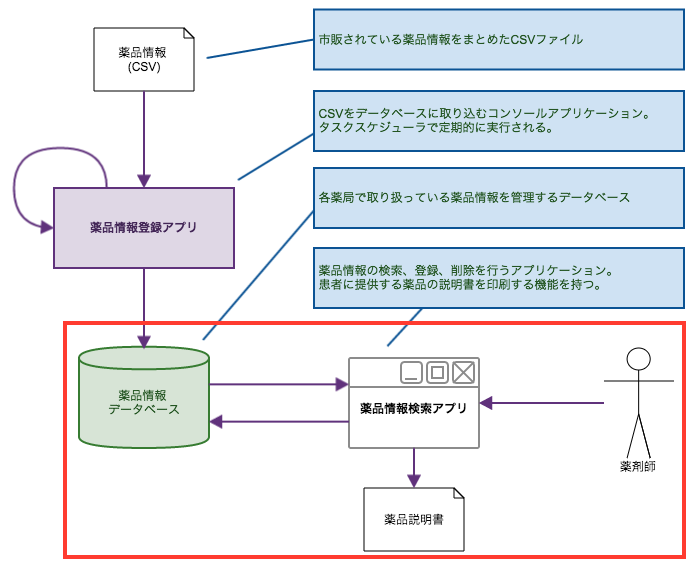

# .NET Framework アプリケーション開発入門

.NET Frameworkを使用したクライアント アプリケーションの開発方法について解説します。

 

## 環境について

* OS: Windows 10
* IDE: Visual Studio 2015
* DB: SQL Server LocalDB (Visual Studio2015インストール時に合わせてインストールしてください)
* その他: Office 2010

 

## サンプル・アプリケーションのイメージ図

薬局内のPCにインストールされる「薬品情報管理システム」を題材とします。

 

各薬局には一般に流通している薬品情報がCSV形式で定期的 (1日1回) に配信されるものとします。

薬局内のPCでは、「薬品情報登録アプリ」が定期的に実行され、
配信されたCSVをそのPC内で稼働しているSQL Serverの特定テーブルに取り込みます。

 

薬剤師は「薬品情報検索アプリ」を使用して、取り込まれたデータを検索します。

CSVに登録されていないがその薬局で取り扱っている薬品情報は、薬剤師が「薬品情報検索アプリ」を使用して登録します。
また、登録したデータは変更、削除が可能です。
(CSVから登録された薬品は編集不可とします)

 

「薬品情報検索アプリ」は、薬局に来られたお客様にお渡しする「薬品説明書」を印刷する機能を持つものとします。

 

------

 
 

## 1. .NET Frameworkの概要と簡単なコンソールアプリケーションの開発

GUIのないコンソールアプリケーションの作成を通して、Entity Frameworkを使用したデータベースのデータ登録、参照、更新、削除の操作について解説します。

------
 

### (1) .NET Frameworkの概要

* 参考: [第1回　Visual Studio 2015って何ができるの？ (1/6)](http://www.atmarkit.co.jp/ait/articles/1508/07/news031.html)

- .NET Frameworkの概要
- Visual Studio 2015の機能
- 開発できるアプリケーションの種類

------
 

### (2) Entity Frameworkによるデータベース操作

* 参考
  - [Entity Framework](https://msdn.microsoft.com/ja-jp/data/ef)
  - [Data Developer Center > Learn > Entity Framework > Get Started > Database First](https://msdn.microsoft.com/en-us/data/jj206878)
  - [連載:ADO.NET Entity Framework入門](http://www.atmarkit.co.jp/fdotnet/ef4basic/index/index.html)

 

CSVファイルを取り込み、SQL Serverに取り込むアプリケーションを作成します。

 

* データの準備
  - CSVファイル
  - データベース
* コンソールアプリケーション プロジェクトの作成
* Entity Frameworkの概要
  - ORマッパーとは
  - Entity Frameworkのインストール
  - EDMの作成
  - POCOの作成
  - Entity Frameworkでのデータ保存、取得
* CSVファイルの読み込み
* DB登録
* 動作確認

------
 

## 2. Windowsフォームアプリケーションの開発

* 参考
  - [連載：Windowsフォーム開発入門【Visual Studio 2010対応】](http://www.atmarkit.co.jp/fdotnet/chushin/introwinform_index/index.html)
  - [EPPlus](http://epplus.codeplex.com/)
  - [EPPlusの基本的な使い方メモ (xlsx形式, Excelのインストール必要ない, COM使わない)](http://devlights.hatenablog.com/entry/2015/04/02/062545)
  - [方法: プログラムによって文書を印刷する](https://msdn.microsoft.com/ja-jp/library/b9f0ke7y.aspx)
  - [EXCEL印刷(Worksheet.PrintOut)のサンプル(C#.NET)](http://homepage2.nifty.com/nonnon/SoftSample/CS.NET/SampleExcelPrint.html)

 

SQL Serverの検索、登録、更新、削除を行うアプリケーションを作成します。

 

* Windowsフォームアプリケーション プロジェクトの作成
  - Entity Frameworkのインストール
  - EDMの作成
  - POCOの作成
* 検索処理の実装
  - イベント処理の実装
  - LINQによるデータ操作
* 更新処理の実装
  - フォームの追加
  - Entity Frameworkでのデータ更新、削除
* Officeファイルの扱い
  - NetOffceによるExcelファイルの作成
  - Excelファイルの更新
* 印刷処理
* 動作確認

 
 

-------

 

## 3. マルチスレッド対応

* 参考
  - [マルチスレッド アプリケーション](https://msdn.microsoft.com/ja-jp/library/ck8bc5c6.aspx)
  - [チュートリアル: BackgroundWorker コンポーネントでのマルチスレッド](https://msdn.microsoft.com/ja-jp/library/ywkkz4s1.aspx)

 

CSV取り込み時に進捗状況を表示するインターフェースを用意します。

取り込み処理中もアプリケーションが固まらないように、CSV読み込み・データ登録処理をバックグラウンドのスレッドで実行します。

 

* Windowsフォームアプリケーション プロジェクトの作成
  - コントロールの配置、イベント処理の実装
* CSVファイルの読み込み
  - フォルダ内のファイル一覧を取得
  - ファイルの操作
  - CSVファイルの読み込み処理の実装
* DB更新処理の実装
  - Entity Frameworkのインストール
  - EDMの作成
  - POCOの作成
  - DB登録
* マルチスレッド対応 - BackgroundWorker コンポーネントでのマルチスレッド
* 動作確認
